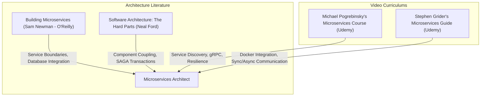

# Part 11: Microservices Architecture Patterns

*[← Back to Master Index](/blog/it-career-guide)*

---

## 1. Introduction: Decomposing the Monolith

In the early stages of a product, a single, monolithic code repository (where the API, database queries, background workers, and business logic live under a single process) is often the most efficient choice. Monoliths are easy to deploy, simple to test, and have zero network latency between logical modules.

However, as organizations grow, monoliths become a bottleneck:
- **Scaling Limits:** You cannot scale individual features independently. If a single report-generation module consumes 90% of the memory, you must duplicate the entire application across larger, expensive servers.
- **Organizational Friction:** Dozens of developers committing to a single repository experience merge conflicts, long CI/CD pipelines, and tight coupling of business domains.
- **Blast Radius:** A bug or memory leak in an isolated feature (like a PDF generation script) crashes the entire platform for all users.

To solve this, elite backend systems in **2026** utilize **Microservices Architecture Patterns**. We decompose the monolithic application into small, autonomous, and loosely coupled services that own their databases (Database-per-Service pattern) and communicate via high-performance network protocols.

Transitioning from a monolithic mindset to microservices is highly complex. You must learn how to define service boundaries using **Domain-Driven Design (DDD)**, manage communication protocols (synchronous gRPC/REST vs. asynchronous event streaming), and handle the inevitable network failures using fault-tolerance patterns (Circuit Breakers, Retries, and Bulkheads).

This chapter is your **Microservices & Fault Tolerance Master Resource Directory**. It contains no basic code snippets. Instead, it directs you to the premium video courses, O'Reilly textbooks, and systems architecture blueprints you must master to build enterprise-scale microservices.

---

## 2. Master Resource Directory: Microservices & Distributed Systems

Here are the precise learning resources, specific syllabus modules, and technical chapters you must consume:

---

### Source 1: *The Complete Microservices & Event-Driven Architecture* by Michael Pogrebinsky
*   **Format:** Project-First Systems Video Course
*   **Platform:** Udemy Business (Free via your TCS Ultimatix SSO gateway)
*   **Direct Link Reference:** [Udemy Course Page](https://www.udemy.com/)
*   **Why It is Selected:** Michael is a senior software architect who focuses on the concrete systems design of microservices. This is not a simple "learn language X" course. It is an advanced architectural guide teaching you how to configure real infrastructure for discovery, load balancing, and fault tolerance.

#### Exact Course Modules to Watch & Execute:
1.  **Watch Section: Microservices Architectural Patterns:** Study how to split a monolith, establish API Gateways (routing, rate limiting), and structure database isolation.
2.  **Watch Section: Inter-Service Communication:** Master the trade-offs of synchronous communication (**gRPC** over HTTP/2 vs. JSON REST) and asynchronous event-driven queues (Kafka).
3.  **Watch Section: Service Discovery & Configuration:** Learn how services register themselves and discover peer instances using service registries.
4.  **Watch Section: Resilience & Fault Tolerance:** This is the most critical module. Master the mechanics of **Circuit Breakers** (using resilience libraries), retries with exponential backoff, and bulkheads.

---

### Source 2: *Building Microservices* (2nd Edition) by Sam Newman
*   **Format:** Definitive Systems Architecture Book
*   **Platform:** O'Reilly Learning (Search inside your TCS O'Reilly account)
*   **Direct Link Reference:** [O'Reilly Book Profile Page](https://learning.oreilly.com/)
*   **Why It is Selected:** The industry-standard textbook on microservices. Sam Newman details the core theoretical principles behind service design, data decomposition, security, and global operational complexity.

#### Exact Chapters to Read:
1.  **Read Chapter 3: How to Model Services:** Learn how to use **Domain-Driven Design (DDD)** to identify **Bounded Contexts** and establish clear, logical service boundaries that map to real business operations.
2.  **Read Chapter 4: Integration:** Master the absolute golden rule of microservices: **Database-per-Service**. Understand why shared databases are a major anti-pattern and how to break them apart safely.
3.  **Read Chapter 11: Scaling:** Learn how to scale microservices horizontally, handle database replication, and manage global traffic distribution.

---

### Source 3: *Software Architecture: The Hard Parts* by Neal Ford, Mark Richards, Pramod Sadalage, and Zhamak Dehghani
*   **Format:** Advanced Engineering Textbook
*   **Platform:** O'Reilly Learning (Search inside your TCS O'Reilly account)
*   **Why It is Selected:** When you split databases, you lose database-level ACID transactions and foreign keys. This book teaches you the actual architectural patterns to solve these "hard parts," specifically handling distributed transactions and data synchronization.

#### Exact Chapters to Read:
1.  **Read Chapter 5: Component Decomposition:** Learn how to analyze monolithic codebases, evaluate coupling metrics, and extract microservices iteratively.
2.  **Read Chapter 9: Distributed Transactions:** Master the **SAGA Pattern** (both Choreography and Orchestration models) and understand why the traditional Two-Phase Commit (2PC) pattern does not scale in modern cloud-native systems.
3.  **Read Chapter 12: Distributed Data Access:** Study how services access data owned by other databases using data replication, CQRS (Command Query Responsibility Segregation), or aggregation layers.

---

### Source 4: *Microservices with Node JS and React* by Stephen Grider
*   **Format:** Hands-On Implementation Video Course
*   **Platform:** Udemy Business (Free via your TCS Ultimatix SSO gateway)
*   **Why It is Selected:** Stephen Grider provides a massive, 50-hour hands-on coding curriculum. He guides you through building a complete multi-service application (an e-commerce ticketing platform) using Node.js, Express, TypeScript, and Docker, illustrating how to handle high-frequency events and ensure data consistency.

#### Exact Course Modules to Watch & Execute:
1.  **Watch Section: Fundamental Integration Issues:** Master dealing with asynchronous data flows, managing duplicate event processing, and setting up clean local development networking.
2.  **Watch Section: NATS Streaming Server:** Learn how to integrate a high-performance message broker to orchestrate events across services.
3.  **Watch Section: Database Management:** See how to maintain consistent database states under concurrent booking windows.

---

## 3. Hands-On Portfolio Lab Project: Resilience-Tuned gRPC API Gateway

To demonstrate your enterprise-grade systems engineering capabilities to international recruiters, you must build and commit a **Resilient gRPC Microservices Mesh** to your public GitHub profile (`github.com/chirag127`).

### The Lab Project Guidelines:
1.  **Multi-Service Layout:** Build a workspace containing three services:
    -   `gateway-service`: A public-facing REST API gateway (FastAPI or Node.js/TS).
    -   `order-service`: An internal business logic service communicating via **gRPC**.
    -   `inventory-service`: An internal inventory tracker communicating via **gRPC**.
2.  **Strict gRPC Protobuf Contracts:**
    -   Write a shared `.proto` file defining request and response messages for `GetInventory` and `ReserveStock`.
    -   Use `grpcio-tools` (Python) or `@grpc/proto-loader` (TS) to compile these protobuf contracts into typed client/server stubs.
3.  **Resilience Circuit Breaker Setup:**
    -   Inside your `gateway-service`, integrate a **Circuit Breaker** (using a library like `tenacity` in Python or `opossum` in Node.js) wrapping the gRPC calls to the internal services.
    -   **Step A (Closed State):** Normal routing. Request hits the Gateway, routes via gRPC to the internal services, and returns within **5ms**.
    -   **Step B (Open State):** If the internal services experience network lag or crash, and 5 consecutive requests fail or timeout (configured at **200ms** limit), the circuit breaker must **trip open**. 
    -   **Step C (Fallback Activation):** When the circuit is **Open**, the Gateway must reject further gRPC calls immediately, returning a cached/stale fallback payload (e.g. `{"status": "degraded", "data": "stale-cache"}`) in **< 1ms**, protecting your database from compounding traffic cascades.
    -   **Step D (Half-Open State):** After **10 seconds**, the circuit shifts to **Half-Open**, allowing a single test request to pass. If it succeeds, the circuit closes; if it fails, it trips open again.
4.  **Exhaustive Readme & Whiteboard:** Your repository README must contain a detailed system sequence diagram (using Mermaid) representing the lifecycle of the Circuit Breaker states, alongside benchmark metrics proving that the gateway fallback resolves instantly without queueing timeout threads.

---

## 4. Technical Interview Self-Assessment

Use these questions to verify if you have successfully digested these learning sources:

| Concept | High-Frequency Interview Question | Expected Technical Answer Framework |
| :--- | :--- | :--- |
| **SAGA Pattern** | What is the SAGA pattern, and how does it differ from a Two-Phase Commit (2PC)? | 2PC is a synchronous block that locks databases across all nodes until everyone commits, which hurts throughput and fails if one coordinator goes down. **SAGA** is an asynchronous event-driven flow where each service performs a local transaction. If a downstream step fails, the SAGA orchestrator triggers **compensating transactions** (backward rollbacks) to restore data consistency without distributed locks. |
| **gRPC vs REST** | Why is gRPC preferred over JSON REST for internal microservice communication? | gRPC uses **HTTP/2** as its transport layer, enabling multiplexing (multiple requests over a single TCP connection), bidirectional streaming, and header compression. Additionally, gRPC serializes payloads into compact binary using **Protocol Buffers (Protobuf)**, which is 5x–10x faster and uses significantly less bandwidth than parsing raw text-based JSON. |
| **Circuit Breakers** | Describe the three states of a Circuit Breaker and how they prevent system-wide failure. | **Closed:** Requests pass normally. **Open:** Requests fail immediately with a fallback error without hitting the degraded downstream service (preventing resource exhaustion / thread pooling). **Half-Open:** A small percentage of requests are allowed through after a cooldown period to check if the downstream service has recovered. |
| **Service Mesh** | What is a Service Mesh, and when should you adopt it? | A Service Mesh (like Istio or Linkerd) is a dedicated infrastructure layer that handles inter-service communication via sidecar proxies. It manages service discovery, load balancing, encryption (mTLS), and traffic routing automatically, decoupling these operational requirements from the application code. Adopt it when managing a massive service footprint (> 20 services) where coding stubs individually becomes untenable. |

---

## 5. Exit Tasks for this Phase

Complete these verification steps before proceeding to Part 12:

- [ ] Complete the Inter-Service Communication and Resilience modules of Michael Pogrebinsky's Microservices course.
- [ ] Read Chapters 3, 4, and 11 in Sam Newman's *Building Microservices* via O'Reilly.
- [ ] Read Chapters 5 and 9 in *Software Architecture: The Hard Parts* via O'Reilly.
- [ ] Commit your fully containerized, resilience-tuned `grpc-resilience-gateway` project to your GitHub profile, showing sequence charts in your README.

---

*[Proceed to Part 12: Docker & Containerization for Backend Developers →](/blog/it-career-guide/part-12-docker)*

---

### The 2026 IT Career Blueprint Series Navigation

- **[Master Index: The 2026 IT Career Blueprint](/blog/it-career-guide)**
- **Part 1:** [The Blueprint & Escape Plan →](/blog/it-career-guide/part-01-the-blueprint)
- **Part 2:** [Advanced Version Control & Git Mastery →](/blog/it-career-guide/part-02-git-github)
- **Part 3:** [The Elite Developer Toolkit & Workflows →](/blog/it-career-guide/part-03-developer-toolkit)
- **Part 4:** [Python Mastery from Scratch →](/blog/it-career-guide/part-04-python-mastery)
- **Part 5:** [Async programming & FastAPI Backend Services →](/blog/it-career-guide/part-05-async-python-fastapi)
- **Part 6:** [TypeScript & Node.js Backend Ecosystems →](/blog/it-career-guide/part-06-typescript-backend)
- **Part 7:** [Relational Databases & Advanced PostgreSQL →](/blog/it-career-guide/part-07-postgresql)
- **Part 8:** [NoSQL Databases (MongoDB & Redis Caching) →](/blog/it-career-guide/part-08-nosql-databases)
- **Part 9:** [Distributed Systems & Message Queues with Kafka →](/blog/it-career-guide/part-09-distributed-systems-kafka)
- **Part 10:** [System Design Principles & Scalable Architecture →](/blog/it-career-guide/part-10-system-design)
- **Part 11:** [Microservices Architecture Patterns →](/blog/it-career-guide/part-11-microservices)
- **Part 12:** [Docker & Containerization for Backend Developers →](/blog/it-career-guide/part-12-docker)
- **Part 13:** [Kubernetes & Container Orchestration →](/blog/it-career-guide/part-13-kubernetes)
- **Part 14:** [Continuous Integration & Deployment (CI/CD) with GitHub Actions →](/blog/it-career-guide/part-14-cicd)
- **Part 15:** [AWS Cloud & Serverless Architectures →](/blog/it-career-guide/part-15-aws-serverless)
- **Part 16:** [Front-End Mastery: React, Next.js & Client-Side Architectures →](/blog/it-career-guide/part-16-frontend-react)
- **Part 17:** [Generative AI & Large Language Models (LLM) Integration →](/blog/it-career-guide/part-17-genai-llms)
- **Part 18:** [Retrieval-Augmented Generation (RAG) & Vector Databases →](/blog/it-career-guide/part-18-rag-vector-db)
- **Part 19:** [AI Agents & Advanced Workflows with LangGraph →](/blog/it-career-guide/part-19-ai-agents-langgraph)
- **Part 20:** [Enterprise Security, Authentication & OWASP Top 10 →](/blog/it-career-guide/part-20-security-auth)
- **Part 21:** [Comprehensive Testing: Unit, Integration, & E2E Testing →](/blog/it-career-guide/part-21-testing)
- **Part 22:** [Data Structures & Algorithms (DSA) and LeetCode Blueprint →](/blog/it-career-guide/part-22-dsa-leetcode)
- **Part 23:** [Tech Interview Success: System Design & Behavioral STAR Method →](/blog/it-career-guide/part-23-tech-interviews)
- **Part 24:** [Global Remote Jobs and Freelancing Platforms →](/blog/it-career-guide/part-24-global-remote)
- **Part 25:** [Immigration, Visas & Tech Relocation →](/blog/it-career-guide/part-25-immigration-visas)
