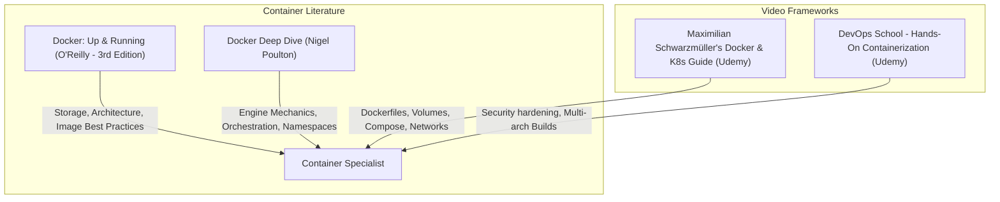

# Part 12: Docker & Containerization for Backend Developers

*[← Back to Master Index](/blog/it-career-guide)*

---

## 1. Introduction: Escaping "Works on My Machine"

As a junior developer, one of the most frustrating bottlenecks you will face is environment inconsistency. You write code that runs perfectly on your local machine, but when it is deployed to a staging server or another developer's workstation, it crashes instantly. This happens because of minor differences in operating system packages, CPU architectures, system-level library configurations, or runtime environment versions (e.g. Node 18 vs. Node 22).

In **2026**, elite software organizations have completely eliminated these variables using **Containerization**. 

A container is a lightweight, isolated execution environment that packages an application along with all its system dependencies, binaries, configuration files, and libraries. Unlike virtual machines, which require an entire guest operating system hypervisor and gigabytes of memory overhead, containers share the host machine's OS kernel, launching in milliseconds and using virtually zero idle CPU or RAM.

For a systems developer, **Docker is an absolute day-one requirement**. You are expected to know how to write optimized Dockerfiles, utilize layer caching to speed up build times, build slim and secure multi-stage production images, orchestrate local multi-container environments using Docker Compose, and configure security parameters (like non-root users) to protect containers in production.

This chapter is your **Docker & Containerization Master Resource Directory**. It contains no simple "Docker run" stubs. Instead, it directs you to the exact video courses, O'Reilly container textbooks, and packaging labs you must master.

---

## 2. Master Resource Directory: Containers & Docker

Here are the precise learning resources, specific syllabus modules, and technical chapters you must consume:



---

### Source 1: *Docker & Kubernetes: The Practical Guide* by Maximilian Schwarzmüller
*   **Format:** Project-First Video Course
*   **Platform:** Udemy Business (Free via your TCS Ultimatix SSO gateway)
*   **Direct Link Reference:** [Udemy Course Page](https://www.udemy.com/)
*   **Why It is Selected:** Maximilian provides an exceptionally clear, highly practical introduction to containers. This course is perfect for developers transitioning from manual development setups to automated container workflows, detailing every core concept (images, containers, volumes, networks, compose) step-by-step.

#### Exact Course Modules to Watch & Execute:
1.  **Watch Section: Docker Images & Containers:** Master the differences between images and containers, how commands execute, and basic container interactive shells.
2.  **Watch Section: Managing Data with Volumes & Bind Mounts:** Understand how to achieve data persistence. Master configuring **Bind Mounts** for instantaneous local hot-reloading code environments and **Named Volumes** for local database state persistence.
3.  **Watch Section: Docker Networking:** Learn how containers communicate with the host, peer containers, and external APIs using bridge networks.
4.  **Watch Section: Multi-Container Applications with Docker Compose:** Learn how to configure a multi-container local stack (web app + database + cache) using a single command.

---

### Source 2: *Docker: Up & Running* (3rd Edition) by Karl Matthias and Sean P. Kane
*   **Format:** Technical Systems Architecture Book
*   **Platform:** O'Reilly Learning (Search inside your TCS O'Reilly account)
*   **Direct Link Reference:** [O'Reilly Book Profile Page](https://learning.oreilly.com/)
*   **Why It is Selected:** The definitive O'Reilly guide to Docker. This book goes deep into container engineering, explaining how Docker utilizes Linux namespace and cgroup isolation under the hood, and detailing production-grade patterns for container layout, logging, and security.

#### Exact Chapters to Read:
1.  **Read Chapter 3: Installing and Configuring Docker:** Focus on the engine architecture and container execution environments.
2.  **Read Chapter 5: Dockerfiles:** Master the commands (`RUN`, `CMD`, `ENTRYPOINT`, `COPY`, `ADD`) and the vital rules for minimizing layer generation.
3.  **Read Chapter 9: Containers in Production:** Read the sections detailing security configuration, resource isolation (restricting CPU and RAM), and container-level logging aggregators.

---

### Source 3: *Docker Deep Dive* by Nigel Poulton
*   **Format:** Systems Engineering Textbook & Video Series
*   **Platform:** O'Reilly Learning (Search inside your TCS O'Reilly account)
*   **Why It is Selected:** Nigel is a Docker Captain and author who has been in the container space since day one. His content focuses deeply on engine internals, teaching you the low-level mechanics of storage drivers, overlay networks, and image registries.

#### Exact Chapters to Read:
1.  **Read Chapter 6: Docker Images:** Deeply study the layer-based union file system architecture of images.
2.  **Read Chapter 8: Docker Networking:** Master the default **Bridge**, **Host**, and **Overlay** network topologies and when to use them.

---

## 3. Hands-On Portfolio Lab Project: Highly Optimized, Secure Multi-Stage Image

To prove your production-grade DevOps competencies to recruiters, you must build and commit a **Highly Optimized, Secure Multi-Stage Container Setup** to your public GitHub profile (`github.com/chirag127`).

### The Lab Project Guidelines:
1.  **FastAPI/Node Application:** Build a simple API backend with database dependencies.
2.  **Highly Optimized Multi-Stage Dockerfile:**
    -   Write a Dockerfile utilizing **Multi-Stage Builds** to separate development dependencies from your production runner.
    -   **Stage 1 (Builder):** Start from a complete base runtime image (e.g. `node:22-alpine` or `python:3.12-slim`). Install build-essential packages, compiler headers, copy package manifest files, and build/compile your native dependencies (like `node_modules` or pip wheels).
    -   **Stage 2 (Runner):** Start from a clean, bare-bones alpine or distroless base image. Copy **only** the built artifacts and production dependencies from the Builder stage. Exclude all compilers, source test files, and package caches.
    -   **Result:** Compile your production image down to **< 60MB** (compared to unoptimized single-stage images which swell to > 800MB), drastically decreasing cold start times and CI/CD deployment speeds.
3.  **Strict Security Hardening (Non-Root User):**
    -   Do not run your container under the default `root` user (which creates massive security vulnerabilities if a container breakout occurs).
    -   Add a dedicated, unprivileged system user inside your Dockerfile:
        ```dockerfile
        RUN addgroup -S appgroup && adduser -S appuser -G appgroup
        USER appuser
        ```
    -   Ensure all copied files are owned by `appuser` using `--chown=appuser:appgroup` flags in the `COPY` instruction.
4.  **Local Dev Composition (Docker Compose):**
    -   Build a `docker-compose.yml` file to spin up your application container along with a **PostgreSQL** container and a **Redis** container.
    -   Configure **Bind Mounts** for your application container so that any code adjustments you save locally trigger auto-reload inside the container instantly without rebuilding.
    -   Use Docker **Named Volumes** to persist database storage across container restarts.
5.  **Exhaustive Readme:** Document the exact image sizes before and after multi-stage optimization, and write a comparison table showing step-by-step layer caching speeds when modifications are made to source files.

---

## 4. Technical Interview Self-Assessment

Use these questions to verify if you have successfully digested these learning sources:

| Concept | High-Frequency Interview Question | Expected Technical Answer Framework |
| :--- | :--- | :--- |
| **Layer Caching** | How does Docker's layer caching work, and how do you structure a Dockerfile to maximize it? | Docker executes Dockerfile instructions sequentially. Each instruction creates a new read-only image layer. If a layer's contents and all previous layers have not changed, Docker reuses the cached layer. To maximize cache hits, place **rarely changing files** (like `package.json` or `requirements.txt` dependency installs) **first**, and **frequently changing files** (like raw application code) **last**. |
| **CMD vs ENTRYPOINT**| What is the difference between `CMD` and `ENTRYPOINT` in a Dockerfile? | `ENTRYPOINT` sets the primary executable process that will always run when the container starts and cannot be easily overridden. `CMD` provides the default arguments passed to the `ENTRYPOINT`. If you run `docker run my-image /custom-command`, the argument `/custom-command` overrides the `CMD` but is appended to the `ENTRYPOINT`. |
| **Container vs VM** | Explain how a container differs from a Virtual Machine (VM). | A VM virtualizes physical hardware, requiring a hypervisor and an entire guest OS kernel, resulting in large image sizes (GBs) and high memory/boot overheads. A container virtualizes the host operating system, sharing the host kernel while utilizing Linux kernel isolation features (**namespaces** for process/network isolation, and **cgroups** for resource limits), resulting in micro-sized runtimes (MBs) and near-instant boot times. |
| **Non-Root Runner** | Why is it critical to run containers under a non-root user in production? | By default, processes running inside a container run as `root` (UID 0). If an attacker finds a vulnerability in your application code and successfully executes a container escape exploit (breaking out to the host machine), they will inherit root-level control over the entire host system. Running under a non-root system user limits their execution bounds strictly to application bounds. |

---

## 5. Exit Tasks for this Phase

Complete these verification steps before proceeding to Part 13:

- [ ] Complete the Images, Volumes, Networking, and Compose modules of Maximilian Schwarzmüller's Docker course.
- [ ] Read Chapters 5 and 9 in *Docker: Up & Running* via O'Reilly.
- [ ] Read Chapter 6 in *Docker Deep Dive* via O'Reilly.
- [ ] Commit your optimized, multi-stage, non-root `docker-compose-dev-mesh` project to your GitHub profile, detailing image sizing benchmarks in your README.

---

*[Proceed to Part 13: Kubernetes & Container Orchestration →](/blog/it-career-guide/part-13-kubernetes)*

---

### The 2026 IT Career Blueprint Series Navigation

- **[Master Index: The 2026 IT Career Blueprint](/blog/it-career-guide)**
- **Part 1:** [The Blueprint & Escape Plan →](/blog/it-career-guide/part-01-the-blueprint)
- **Part 2:** [Advanced Version Control & Git Mastery →](/blog/it-career-guide/part-02-git-github)
- **Part 3:** [The Elite Developer Toolkit & Workflows →](/blog/it-career-guide/part-03-developer-toolkit)
- **Part 4:** [Python Mastery from Scratch →](/blog/it-career-guide/part-04-python-mastery)
- **Part 5:** [Async programming & FastAPI Backend Services →](/blog/it-career-guide/part-05-async-python-fastapi)
- **Part 6:** [TypeScript & Node.js Backend Ecosystems →](/blog/it-career-guide/part-06-typescript-backend)
- **Part 7:** [Relational Databases & Advanced PostgreSQL →](/blog/it-career-guide/part-07-postgresql)
- **Part 8:** [NoSQL Databases (MongoDB & Redis Caching) →](/blog/it-career-guide/part-08-nosql-databases)
- **Part 9:** [Distributed Systems & Message Queues with Kafka →](/blog/it-career-guide/part-09-distributed-systems-kafka)
- **Part 10:** [System Design Principles & Scalable Architecture →](/blog/it-career-guide/part-10-system-design)
- **Part 11:** [Microservices Architecture Patterns →](/blog/it-career-guide/part-11-microservices)
- **Part 12:** [Docker & Containerization for Backend Developers →](/blog/it-career-guide/part-12-docker)
- **Part 13:** [Kubernetes & Container Orchestration →](/blog/it-career-guide/part-13-kubernetes)
- **Part 14:** [Continuous Integration & Deployment (CI/CD) with GitHub Actions →](/blog/it-career-guide/part-14-cicd)
- **Part 15:** [AWS Cloud & Serverless Architectures →](/blog/it-career-guide/part-15-aws-serverless)
- **Part 16:** [Front-End Mastery: React, Next.js & Client-Side Architectures →](/blog/it-career-guide/part-16-frontend-react)
- **Part 17:** [Generative AI & Large Language Models (LLM) Integration →](/blog/it-career-guide/part-17-genai-llms)
- **Part 18:** [Retrieval-Augmented Generation (RAG) & Vector Databases →](/blog/it-career-guide/part-18-rag-vector-db)
- **Part 19:** [AI Agents & Advanced Workflows with LangGraph →](/blog/it-career-guide/part-19-ai-agents-langgraph)
- **Part 20:** [Enterprise Security, Authentication & OWASP Top 10 →](/blog/it-career-guide/part-20-security-auth)
- **Part 21:** [Comprehensive Testing: Unit, Integration, & E2E Testing →](/blog/it-career-guide/part-21-testing)
- **Part 22:** [Data Structures & Algorithms (DSA) and LeetCode Blueprint →](/blog/it-career-guide/part-22-dsa-leetcode)
- **Part 23:** [Tech Interview Success: System Design & Behavioral STAR Method →](/blog/it-career-guide/part-23-tech-interviews)
- **Part 24:** [Global Remote Jobs and Freelancing Platforms →](/blog/it-career-guide/part-24-global-remote)
- **Part 25:** [Immigration, Visas & Tech Relocation →](/blog/it-career-guide/part-25-immigration-visas)
