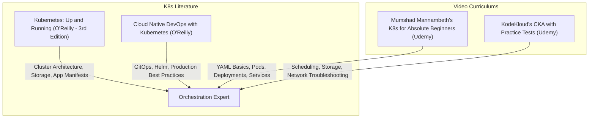

# Part 13: Kubernetes & Container Orchestration

*[← Back to Master Index](/blog/it-career-guide)*

---

## 1. Introduction: Scaling Containers to Production

While packaging your application into a Docker container solves the "works on my machine" problem, running a single container on a single virtual machine is not enough for modern production scaling. 

What happens when your container crashes at 3:00 AM? How do you scale from one running instance to fifty during a traffic surge, and then down to five to save hosting costs? How do you distribute network traffic uniformly across all these container copies without manually altering IP tables? How do you perform rolling deployments (updating code with zero-downtime) while retaining the ability to rollback instantly if a critical bug appears?

To solve these global enterprise scalability challenges, the modern tech ecosystem in **2026** relies on **Kubernetes (K8s)**. 

Originally built by Google, Kubernetes is an open-source container orchestration platform designed to automate the deployment, scaling, load balancing, and operational monitoring of containerized workloads. It acts as an operating system for your cluster of physical or virtual servers, treating them all as a single, massive pool of compute power.

For a software engineer seeking highly paid roles in distributed systems, platforms, or GenAI, **Kubernetes is the gold standard of infrastructure expertise**. You are not required to configure cloud networking from scratch, but you must know how to construct declarative Kubernetes manifests defining Pods, Deployments, Services (ClusterIP, NodePort, LoadBalancer), Ingress routes, ConfigMaps, Secrets, resource constraints, and health probes.

This chapter is your **Kubernetes & Orchestration Master Resource Directory**. It contains no basic, hand-waving templates. Instead, it points you to the exact hands-on video courses, O'Reilly textbooks, and deployment validation labs you must master.

---

## 2. Master Resource Directory: Kubernetes & Orchestration

Here are the precise learning resources, specific syllabus modules, and technical chapters you must consume:



---

### Source 1: *Kubernetes for the Absolute Beginners - Hands-on* by Mumshad Mannambeth (KodeKloud)
*   **Format:** Deep-Dive Interactive Video Course
*   **Platform:** Udemy Business (Free via your TCS Ultimatix SSO gateway)
*   **Direct Link Reference:** [Udemy Course Page](https://www.udemy.com/)
*   **Why It is Selected:** Mumshad is legendary in the DevOps space for his interactive browser-based labs. He makes Kubernetes' complex YAML structure highly approachable, teaching you how to write declarative configurations from first principles with instant validation.

#### Exact Course Modules to Watch & Execute:
1.  **Watch Section: Kubernetes Introduction:** Understand the core cluster components: **Control Plane** (API Server, etcd, Scheduler, Controller Manager) vs. **Worker Nodes** (Kubelet, Kube-Proxy, Container Runtime).
2.  **Watch Section: Pods:** Master the fundamental execution unit in K8s: how Pods encapsulate containers.
3.  **Watch Section: ReplicaSets & Deployments:** Learn how to declare replicas, execute rolling updates, and rollback versions.
4.  **Watch Section: Services:** Master setting up **ClusterIP** (internal service-to-service communication) and **NodePort** (exposing ports externally).

---

### Source 2: *Certified Kubernetes Administrator (CKA) with Practice Tests* by Mumshad Mannambeth (KodeKloud)
*   **Format:** Advanced Hands-On Video & Lab Certification Course
*   **Platform:** Udemy Business (Free via your TCS Ultimatix SSO gateway)
*   **Why It is Selected:** Even if you do not plan to pay for the CKA exam, this course is the single best resource on the internet to master advanced operational Kubernetes patterns. It covers configuration files, storage options, ingress controllers, scheduling, and real-world cluster troubleshooting.

#### Exact Course Modules to Watch & Execute:
1.  **Watch Section: Application Lifecycle Management:** Master configuring ConfigMaps, Secrets, multi-container Pods, and Init Containers.
2.  **Watch Section: Storage:** Learn how to use **Persistent Volumes (PV)**, **Persistent Volume Claims (PVC)**, and Storage Classes to persist stateful database containers.
3.  **Watch Section: Networking:** Understand the Kubernetes container network interface (CNI), CoreDNS service lookup, and configuring **Ingress Controllers** (mapping hostname subdomains like `api.oriz.in` to internal services).

---

### Source 3: *Kubernetes: Up and Running* (3rd Edition) by Brendan Burns, Joe Beda, Kelsey Hightower, and Lachlan Evenson
*   **Format:** Definitive Systems Architecture Book
*   **Platform:** O'Reilly Learning (Search inside your TCS O'Reilly account)
*   **Direct Link Reference:** [O'Reilly Book Profile Page](https://learning.oreilly.com/)
*   **Why It is Selected:** Co-authored by the original founders of Kubernetes at Google. This O'Reilly guide focuses heavily on the "why" behind the platform's design decisions, explaining declarative state reconciliation, storage overlays, and API architectures.

#### Exact Chapters to Read:
1.  **Read Chapter 5: Pods:** Deeply study the lifetime of a Pod, lifecycle hooks, and container state synchronization.
2.  **Read Chapter 6: Label and Annotations:** Learn how to use labels to group, filter, and route traffic to resource pods dynamically.
3.  **Read Chapter 8: HTTP Load Balancing with Ingress:** Master configuring host-based and path-based ingress load balancing rules.

---

## 3. Hands-On Portfolio Lab Project: Declared, Load-Balanced Microservice Mesh

To prove your cloud-native platform competency to engineering managers, you must build and commit a complete **Kubernetes Orchestration Mesh** to your public GitHub profile (`github.com/chirag127`).

### The Lab Project Guidelines:
1.  **Local Kubernetes Cluster:** Spin up a local Kubernetes cluster using **Minikube**, **Kind**, or **Docker Desktop Kubernetes**.
2.  **Declarative Manifest Setup:**
    -   Write a directory of YAML manifests (`/k8s`) containing:
        -   `api-deployment.yaml`: A deployment manifest running 3 replicas of your FastAPI or Node.js web app.
        -   `api-service.yaml`: A **ClusterIP** service exposing your application internally.
        -   `postgres-stateful.yaml`: A stateful deployment using a **PersistentVolumeClaim** to secure database storage.
        -   `postgres-service.yaml`: A ClusterIP service exposing the database to the API.
3.  **Zero-Downtime Rolling Update & Probes:**
    -   Inside your `api-deployment.yaml`, configure rolling update parameters:
        ```yaml
        strategy:
          type: RollingUpdate
          rollingUpdate:
            maxSurge: 1
            maxUnavailable: 0
        ```
    -   Configure **Liveness Probes** (asking: is the container crashed?) and **Readiness Probes** (asking: is the database connected and ready to receive traffic?) to prevent routing users to loading containers:
        ```yaml
        readinessProbe:
          httpGet:
            path: /healthz
            port: 8000
          initialDelaySeconds: 5
          periodSeconds: 10
        ```
4.  **Resource Constraints (CPU/RAM limits):**
    -   Protect your cluster from memory leaks or CPU hogs by defining strict resource requests and limits:
        ```yaml
        resources:
          requests:
            memory: "128Mi"
            cpu: "250m"
          limits:
            memory: "256Mi"
            cpu: "500m"
        ```
5.  **Exhaustive Readme:** Detail Minikube startup commands, the exact kubectl commands to apply the YAML directories, and output snapshots of `kubectl get pods -o wide` displaying the distributed, load-balanced container layout.

---

## 4. Technical Interview Self-Assessment

Use these questions to verify if you have successfully digested these learning sources:

| Concept | High-Frequency Interview Question | Expected Technical Answer Framework |
| :--- | :--- | :--- |
| **Liveness vs Readiness** | What is the difference between a Liveness Probe and a Readiness Probe in a Kubernetes deployment? | **Liveness Probe:** Checks if the container process is running. If it fails, the Kubelet restarts the container immediately. **Readiness Probe:** Checks if the application is fully initialized and connected to databases/caches. If it fails, Kubernetes stops routing user traffic to the Pod but does **not** restart it, ensuring users never hit loading instances. |
| **Deployment vs Pod** | Why should you never deploy raw Pods directly, and use a Deployment manifest instead? | A Pod is ephemeral; if a physical server node hosting a raw Pod dies, the Pod is lost forever. A **Deployment** manages a declarative **ReplicaSet** under the hood. It constantly monitors cluster states to ensure the requested replica count (e.g. 3 copies) is satisfied; if a pod or node crashes, it automatically schedules a new Pod on a healthy node. |
| **Ingress vs LoadBalancer** | What is the difference between a Kubernetes Ingress Controller and a Service of type `LoadBalancer`? | A service of type `LoadBalancer` provisions a dedicated, expensive physical load balancer from your cloud provider (e.g. AWS NLB) for **each** service, which is highly inefficient. **Ingress** acts as a single API Gateway (using Nginx/Envoy) that routes external traffic to multiple internal ClusterIP services based on path (e.g. `/api`) or host (e.g. `oriz.in`). |
| **ConfigMaps vs Secrets** | How do ConfigMaps and Secrets differ, and how are Secrets secured in Kubernetes? | **ConfigMaps:** Store non-sensitive configuration data (e.g. environment flags) in plain text. **Secrets:** Store sensitive data (e.g. API keys, database credentials) encoded in Base64. By default, K8s secrets are stored in plain text inside etcd; in enterprise systems, they must be encrypted at rest or integrated with external vaults (like HashiCorp Vault or AWS Secrets Manager). |

---

## 5. Exit Tasks for this Phase

Complete these verification steps before proceeding to Part 14:

- [ ] Complete the Control Plane, Pods, Deployments, and Services modules of Mumshad's Absolute Beginners course.
- [ ] Complete the CKA Practice Labs on Storage, Networking, and Application Lifecycle Management.
- [ ] Read Chapters 5 and 8 in *Kubernetes: Up and Running* via O'Reilly.
- [ ] Commit your fully declared `k8s-minikube-mesh` project containing resource limits and health probes to your public GitHub profile.

---

*[Proceed to Part 14: Continuous Integration & Deployment (CI/CD) with GitHub Actions →](/blog/it-career-guide/part-14-cicd)*

---

### The 2026 IT Career Blueprint Series Navigation

- **[Master Index: The 2026 IT Career Blueprint](/blog/it-career-guide)**
- **Part 1:** [The Blueprint & Escape Plan →](/blog/it-career-guide/part-01-the-blueprint)
- **Part 2:** [Advanced Version Control & Git Mastery →](/blog/it-career-guide/part-02-git-github)
- **Part 3:** [The Elite Developer Toolkit & Workflows →](/blog/it-career-guide/part-03-developer-toolkit)
- **Part 4:** [Python Mastery from Scratch →](/blog/it-career-guide/part-04-python-mastery)
- **Part 5:** [Async programming & FastAPI Backend Services →](/blog/it-career-guide/part-05-async-python-fastapi)
- **Part 6:** [TypeScript & Node.js Backend Ecosystems →](/blog/it-career-guide/part-06-typescript-backend)
- **Part 7:** [Relational Databases & Advanced PostgreSQL →](/blog/it-career-guide/part-07-postgresql)
- **Part 8:** [NoSQL Databases (MongoDB & Redis Caching) →](/blog/it-career-guide/part-08-nosql-databases)
- **Part 9:** [Distributed Systems & Message Queues with Kafka →](/blog/it-career-guide/part-09-distributed-systems-kafka)
- **Part 10:** [System Design Principles & Scalable Architecture →](/blog/it-career-guide/part-10-system-design)
- **Part 11:** [Microservices Architecture Patterns →](/blog/it-career-guide/part-11-microservices)
- **Part 12:** [Docker & Containerization for Backend Developers →](/blog/it-career-guide/part-12-docker)
- **Part 13:** [Kubernetes & Container Orchestration →](/blog/it-career-guide/part-13-kubernetes)
- **Part 14:** [Continuous Integration & Deployment (CI/CD) with GitHub Actions →](/blog/it-career-guide/part-14-cicd)
- **Part 15:** [AWS Cloud & Serverless Architectures →](/blog/it-career-guide/part-15-aws-serverless)
- **Part 16:** [Front-End Mastery: React, Next.js & Client-Side Architectures →](/blog/it-career-guide/part-16-frontend-react)
- **Part 17:** [Generative AI & Large Language Models (LLM) Integration →](/blog/it-career-guide/part-17-genai-llms)
- **Part 18:** [Retrieval-Augmented Generation (RAG) & Vector Databases →](/blog/it-career-guide/part-18-rag-vector-db)
- **Part 19:** [AI Agents & Advanced Workflows with LangGraph →](/blog/it-career-guide/part-19-ai-agents-langgraph)
- **Part 20:** [Enterprise Security, Authentication & OWASP Top 10 →](/blog/it-career-guide/part-20-security-auth)
- **Part 21:** [Comprehensive Testing: Unit, Integration, & E2E Testing →](/blog/it-career-guide/part-21-testing)
- **Part 22:** [Data Structures & Algorithms (DSA) and LeetCode Blueprint →](/blog/it-career-guide/part-22-dsa-leetcode)
- **Part 23:** [Tech Interview Success: System Design & Behavioral STAR Method →](/blog/it-career-guide/part-23-tech-interviews)
- **Part 24:** [Global Remote Jobs and Freelancing Platforms →](/blog/it-career-guide/part-24-global-remote)
- **Part 25:** [Immigration, Visas & Tech Relocation →](/blog/it-career-guide/part-25-immigration-visas)
