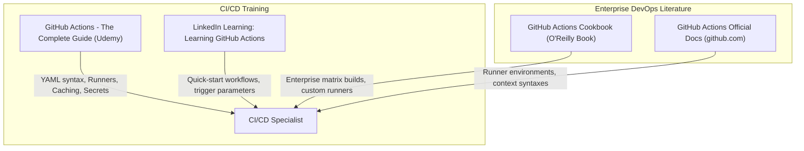

# Part 14: Continuous Integration & Deployment (CI/CD) with GitHub Actions

*[← Back to Master Index](/blog/it-career-guide)*

---

## 1. Introduction: The Pipeline of Automated Delivery

In legacy development environments, testing and deploying software are manual, high-risk operational chores. Developers write code locally, compile it manually, execute a few quick tests in their console, and then copy the files to production via FTP or log into a server to run a manual `git pull`. 

This approach is highly prone to human error. A single developer forgetting to execute the test suite, leaving debugging lines in production, or building with a stale package cache can trigger immediate application outages.

To prevent this, elite engineering teams in **2026** use **Continuous Integration and Continuous Deployment (CI/CD)** pipelines. 

CI/CD is the practice of automating the entire integration, testing, packaging, and delivery process:
- **Continuous Integration (CI):** Every single git push or pull request automatically triggers a remote build runner. The runner spins up your environment, applies linting rules, verifies TypeScript/Python type checks, executes your unit and integration test suites, and blocks pull requests if any test fails, ensuring the shared branch remains stable.
- **Continuous Deployment (CD):** Once the CI tests pass and code is merged to the main branch, the pipeline automatically packages the code into an optimized Docker image, publishes it to a container registry, and deploys it to your staging or production cloud environment with zero manual intervention.

As a platform and backend engineer, **GitHub Actions is the ultimate modern CI/CD standard**. You must know how to construct declarative workflow files, manage environment-specific credentials safely, establish layer caching to optimize runner speeds, run parallel matrix test suites, and deploy to container registries.

This chapter is your **GitHub Actions CI/CD Master Resource Directory**. It contains no basic YAML stubs. Instead, it points you to the exact video courses, official manuals, and pipeline setups you must master.

---

## 2. Master Resource Directory: CI/CD & GitHub Actions

Here are the precise learning resources, specific syllabus modules, and technical chapters you must consume:



---

### Source 1: *GitHub Actions - The Complete Guide* by Maximilian Schwarzmüller
*   **Format:** Project-First Video Course
*   **Platform:** Udemy Business (Free via your TCS Ultimatix SSO gateway)
*   **Direct Link Reference:** [Udemy Course Page](https://www.udemy.com/)
*   **Why It is Selected:** Maximilian excels at teaching automation. He guides you from basic one-step automation workflows into complex, multi-job pipelines containing caching, conditional triggers, custom actions, and environment secrets management.

#### Exact Course Modules to Watch & Execute:
1.  **Watch Section: Workflows, Jobs & Steps:** Master the core components: what triggers workflows, how jobs run in parallel, and how steps execute sequentially.
2.  **Watch Section: Accessing Contexts & Environment Variables:** Learn how to access default GitHub runner contexts (repository metadata, run IDs) and inject environment configurations safely.
3.  **Watch Section: Working with Secrets & Environments:** Master utilizing **GitHub Secrets** (`secrets.GITHUB_TOKEN`, custom repository secrets) to securely communicate with external cloud registries.
4.  **Watch Section: Optimization & Caching:** Learn how to use actions like `actions/cache` to cache npm `node_modules` or python `venv` dependency folders, reducing build times from minutes to seconds.

---

### Source 2: *GitHub Actions Cookbook* by Veera Sundaravel
*   **Format:** Deep-Dive Technical Recipe Book
*   **Platform:** O'Reilly Learning (Search inside your TCS O'Reilly account)
*   **Direct Link Reference:** [O'Reilly Book Profile Page](https://learning.oreilly.com/)
*   **Why It is Selected:** A highly practical guide containing robust, production-ready YAML templates for continuous integration. It covers matrix builds (testing across multiple Node/Python versions simultaneously), building multi-platform containers, and managing self-hosted runners.

#### Exact Chapters to Read:
1.  **Read Chapter 2: Building and Testing Applications:** Master configuring automated testing runs for Node.js, Python, and Go applications.
2.  **Read Chapter 5: Advanced Workflows:** Master configuring **Matrix Builds** to test code against multiple operational parameters concurrently and utilizing conditional `if` triggers.
3.  **Read Chapter 7: Reusable Workflows and Custom Actions:** Learn how to write reusable pipelines to prevent DRY (Don't Repeat Yourself) violations across large enterprise repositories.

---

### Source 3: *GitHub Actions Official Documentation*
*   **Format:** Comprehensive Technical Documentation & Guides
*   **Platform:** GitHub official website (Free Public Access)
*   **Direct Link Reference:** [docs.github.com/en/actions](https://docs.github.com/en/actions)
*   **Why It is Selected:** Since GitHub Actions updates frequently, checking the official documentation is the gold standard for tracking new workflow contexts, runner operating systems, and API additions.

#### Exact Sections to Read:
1.  **Read Section: Writing Workflows:** Master the complete syntax schema for `.github/workflows/` files.
2.  **Read Section: Security Hardening for GitHub Actions:** Learn how to protect your runners from malicious code injection, set up minimal token permissions, and secure secret exposures.

---

## 3. Hands-On Portfolio Lab Project: Secure, Cached CI/CD Pipeline

To prove your automated deployment and DevOps capabilities to senior systems architects, you must build and commit a complete **Secure GitHub Actions Pipeline** to your public GitHub profile (`github.com/chirag127`).

### The Lab Project Guidelines:
1.  **Repository Setup:** Initialize a public GitHub repository hosting a backend application (Python/FastAPI or TypeScript/Node) containing a basic unit test suite.
2.  **Multistage Automated Workflow:**
    -   Create a file `.github/workflows/deploy.yml` inside your repository containing two sequential, dependent jobs: `test` and `publish`.
3.  **Job 1 (Test - Parallel & Cached CI):**
    -   **Parallel Matrix Runs:** Configure the job to run tests across three distinct Python or Node versions simultaneously using matrix parameters:
        ```yaml
        strategy:
          matrix:
            version: [18, 20, 22]
        ```
    -   **Fast Dependency Caching:** Configure the workflow to cache your dependencies (using `actions/setup-node` with `cache: 'npm'` or `actions/setup-python` with `cache: 'pip'`) to prevent reinstalling the entire package tree from scratch on every run.
    -   **Linting & Verification:** Add steps to run your code formatter/linter (e.g. Biome, ESLint, or Black) and type-checkers (e.g. `tsc` or `mypy`).
    -   **Execution:** Run your test suite. Ensure all steps utilize `continue-on-error: true` for testing outputs so you can see which test cases failed across different matrix versions.
4.  **Job 2 (Publish - Docker Registry CD):**
    -   Configure the job to run **only** if the `test` job succeeds (`needs: test`) and the commit is pushed to the `main` branch.
    -   **Registry Authentication:** Log into the **GitHub Container Registry (GHCR)** securely utilizing GitHub's automatic session token:
        ```yaml
        - name: Log in to GHCR
          uses: docker/login-action@v3
          with:
            registry: ghcr.io
            username: ${{ github.actor }}
            password: ${{ secrets.GITHUB_TOKEN }}
        ```
    -   **Secure Docker Packaging:** Build your optimized Docker image and push it to GHCR, tagging it with the exact git commit SHA: `ghcr.io/chirag127/my-app:${{ github.sha }}`.
5.  **Exhaustive Readme:** Detail the step-by-step pipeline progression, display green status badges from your workflow run in your repository main header, and document typical build times showing the cache-based speed increase.

---

## 4. Technical Interview Self-Assessment

Use these questions to verify if you have successfully digested these learning sources:

| Concept | High-Frequency Interview Question | Expected Technical Answer Framework |
| :--- | :--- | :--- |
| **Secrets Security** | How do you prevent sensitive credentials from leaking inside GitHub Actions logs? | Store all sensitive credentials (API keys, database URIs, passwords) inside **GitHub Secrets** within the repository settings. In your YAML file, inject these secrets as environment variables (`${{ secrets.MY_SECRET }}`) directly into individual container step runs. GitHub Actions automatically masks values matching these secrets in the console output as `***` to prevent log leakage. |
| **Needs Keyword** | What does the `needs` keyword accomplish in a GitHub Actions workflow, and why is it useful? | By default, all jobs in a GitHub Actions workflow run in parallel. The `needs` keyword establishes sequential **job dependencies**. For example, configuring `publish: needs: test` ensures the `publish` job will wait for the `test` job to successfully complete first, preventing broken code from ever being packaged or deployed. |
| **Self-Hosted Runner** | What is a Self-Hosted Runner, and when would you choose it over GitHub-Hosted Runners? | **GitHub-Hosted Runners:** Virtual machines managed by GitHub, providing clean environments but limited resources and charging by the minute. **Self-Hosted Runners:** Physical servers or VMs that you configure and maintain yourself. Choose them when you require custom operating systems, native GPU hardware (essential for LLM model compiles), access to local network boundaries, or want to avoid usage costs for heavy enterprise compiles. |
| **Matrix Strategy** | How does the `matrix` strategy work, and what is its primary benefit? | A `matrix` strategy allows you to run multiple configurations of a single job simultaneously. By declaring a matrix grid of options (e.g. 3 operating systems $\times$ 3 Python versions), GitHub automatically spawns 9 parallel runner environments. This enables comprehensive cross-environment compatibility testing in a fraction of the time it would take to run them sequentially. |

---

## 5. Exit Tasks for this Phase

Complete these verification steps before proceeding to Part 15:

- [ ] Complete the Workflows, Environments, and Secrets modules of Maximilian Schwarzmüller's GitHub Actions course.
- [ ] Read Chapters 2 and 5 in the *GitHub Actions Cookbook* via O'Reilly.
- [ ] Read the Security Hardening guide on the official GitHub Actions Docs.
- [ ] Commit your fully automated, cached, multi-stage `.github/workflows/deploy.yml` pipeline (pushing to GHCR) to your GitHub profile, showing green workflow badges on your profile page.

---

*[Proceed to Part 15: AWS Cloud & Serverless Architectures →](/blog/it-career-guide/part-15-aws-serverless)*

---

### The 2026 IT Career Blueprint Series Navigation

- **[Master Index: The 2026 IT Career Blueprint](/blog/it-career-guide)**
- **Part 1:** [The Blueprint & Escape Plan →](/blog/it-career-guide/part-01-the-blueprint)
- **Part 2:** [Advanced Version Control & Git Mastery →](/blog/it-career-guide/part-02-git-github)
- **Part 3:** [The Elite Developer Toolkit & Workflows →](/blog/it-career-guide/part-03-developer-toolkit)
- **Part 4:** [Python Mastery from Scratch →](/blog/it-career-guide/part-04-python-mastery)
- **Part 5:** [Async programming & FastAPI Backend Services →](/blog/it-career-guide/part-05-async-python-fastapi)
- **Part 6:** [TypeScript & Node.js Backend Ecosystems →](/blog/it-career-guide/part-06-typescript-backend)
- **Part 7:** [Relational Databases & Advanced PostgreSQL →](/blog/it-career-guide/part-07-postgresql)
- **Part 8:** [NoSQL Databases (MongoDB & Redis Caching) →](/blog/it-career-guide/part-08-nosql-databases)
- **Part 9:** [Distributed Systems & Message Queues with Kafka →](/blog/it-career-guide/part-09-distributed-systems-kafka)
- **Part 10:** [System Design Principles & Scalable Architecture →](/blog/it-career-guide/part-10-system-design)
- **Part 11:** [Microservices Architecture Patterns →](/blog/it-career-guide/part-11-microservices)
- **Part 12:** [Docker & Containerization for Backend Developers →](/blog/it-career-guide/part-12-docker)
- **Part 13:** [Kubernetes & Container Orchestration →](/blog/it-career-guide/part-13-kubernetes)
- **Part 14:** [Continuous Integration & Deployment (CI/CD) with GitHub Actions →](/blog/it-career-guide/part-14-cicd)
- **Part 15:** [AWS Cloud & Serverless Architectures →](/blog/it-career-guide/part-15-aws-serverless)
- **Part 16:** [Front-End Mastery: React, Next.js & Client-Side Architectures →](/blog/it-career-guide/part-16-frontend-react)
- **Part 17:** [Generative AI & Large Language Models (LLM) Integration →](/blog/it-career-guide/part-17-genai-llms)
- **Part 18:** [Retrieval-Augmented Generation (RAG) & Vector Databases →](/blog/it-career-guide/part-18-rag-vector-db)
- **Part 19:** [AI Agents & Advanced Workflows with LangGraph →](/blog/it-career-guide/part-19-ai-agents-langgraph)
- **Part 20:** [Enterprise Security, Authentication & OWASP Top 10 →](/blog/it-career-guide/part-20-security-auth)
- **Part 21:** [Comprehensive Testing: Unit, Integration, & E2E Testing →](/blog/it-career-guide/part-21-testing)
- **Part 22:** [Data Structures & Algorithms (DSA) and LeetCode Blueprint →](/blog/it-career-guide/part-22-dsa-leetcode)
- **Part 23:** [Tech Interview Success: System Design & Behavioral STAR Method →](/blog/it-career-guide/part-23-tech-interviews)
- **Part 24:** [Global Remote Jobs and Freelancing Platforms →](/blog/it-career-guide/part-24-global-remote)
- **Part 25:** [Immigration, Visas & Tech Relocation →](/blog/it-career-guide/part-25-immigration-visas)
