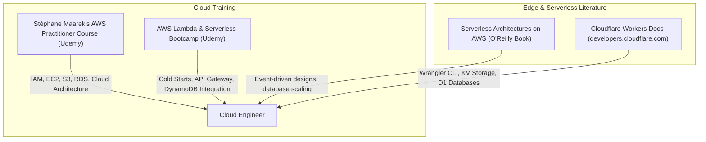

# Part 15: AWS Cloud & Serverless Architectures

*[← Back to Master Index](/blog/it-career-guide)*

---

## 1. Introduction: The Evolution of Cloud Infrastructure

In the early decades of the web, hosting a backend application required renting physical servers inside a private data center. Engineers had to manually purchase CPU processors, physically mount storage drives in racks, configure networking switches, and pay massive upfront capital expenditures just to support basic web traffic.

In **2026**, this hardware-level manual labor is entirely obsolete. The tech landscape relies on **Cloud Computing** and **Serverless Architectures**.

Instead of buying physical hardware, we lease compute power, storage spaces, and managed databases instantly from major cloud providers like **Amazon Web Services (AWS)**, **Google Cloud Platform (GCP)**, or **Microsoft Azure**. 

Furthermore, instead of renting full virtual servers (like AWS EC2) which run continuously and incur 24/7 billing costs even when idle, modern developers build **Serverless Applications**. In a serverless topology (such as **AWS Lambda** or **Cloudflare Workers**), you write standalone functions that execute in response to HTTP events. The cloud provider handles all cluster scaling, load balancing, and server maintenance under the hood. You are billed exclusively for the exact milliseconds your code runs, bringing hosting costs down to near-zero.

For a Full-Stack Platform or Backend Engineer, **Cloud and Serverless competence is a critical career multiplier**. To land high-paying roles in product companies or international startups, you must master the core cloud abstractions (IAM access boundaries, EC2 virtual nodes, S3 object stores, RDS database engines) and understand how to develop and deploy edge-optimized serverless endpoints.

This chapter is your **AWS & Serverless Master Resource Directory**. It contains no basic tutorials. Instead, it directs you to the exact video courses, cloud textbooks, and serverless edge labs you must master.

---

## 2. Master Resource Directory: AWS Cloud & Serverless

Here are the precise learning resources, specific syllabus modules, and technical chapters you must consume:



---

### Source 1: *Ultimate AWS Certified Cloud Practitioner* by Stéphane Maarek
*   **Format:** Deep-Dive Video Certification Course
*   **Platform:** Udemy Business (Free via your TCS Ultimatix SSO gateway)
*   **Direct Link Reference:** [Udemy Course Page](https://www.udemy.com/)
*   **Why It is Selected:** Stéphane Maarek is a world-renowned AWS Hero. Even if you do not plan to pay for the certification exam, this course is the absolute single best structured video curriculum on the internet to master the massive AWS ecosystem, explaining the precise usage of core infrastructure components.

#### Exact Course Modules to Watch & Execute:
1.  **Watch Section: Identity and Access Management (IAM):** Master establishing users, groups, policies, and roles, conforming to the absolute golden security rule of **Least Privilege**.
2.  **Watch Section: AWS Compute:** Learn the precise usage of **EC2** (Elastic Compute Cloud virtual nodes), **ECS** (Elastic Container Service), and **EKS** (Managed Kubernetes).
3.  **Watch Section: AWS Storage:** Master **S3** (Simple Storage Service object store), bucket policies, and EBS block storage.
4.  **Watch Section: AWS Databases:** Master managed relational engines via **RDS**, caching clusters via **ElastiCache**, and key-value tables via **DynamoDB**.

---

### Source 2: *AWS Lambda & Serverless Architecture Bootcamp* by Riyaz Sayyad
*   **Format:** Hands-On Implementation Video Course
*   **Platform:** Udemy Business (Free via your TCS Ultimatix SSO gateway)
*   **Why It is Selected:** Riyaz focuses deeply on the architectural mechanics of building completely serverless backends on AWS. He teaches you how to map REST endpoints, handle heavy concurrent traffic, and integrate databases without traditional connection pooling limits.

#### Exact Course Modules to Watch & Execute:
1.  **Watch Section: Introduction to AWS Lambda:** Master standard function setups, runtime versions, and the physical execution lifecycle.
2.  **Watch Section: API Gateway Integration:** Learn how to configure **Amazon API Gateway** to route public HTTP requests directly into your Lambda functions.
3.  **Watch Section: Cold Starts and Resource Allocation:** Understand the vital concept of **Cold Starts** (latency overhead during first function invocation), memory configuration sizing, and provisioned concurrency.

---

### Source 3: *Serverless Architectures on AWS* (2nd Edition) by Peter Sbarski
*   **Format:** Technical Systems Architecture Book
*   **Platform:** O'Reilly Learning (Search inside your TCS O'Reilly account)
*   **Direct Link Reference:** [O'Reilly Book Profile Page](https://learning.oreilly.com/)
*   **Why It is Selected:** A comprehensive O'Reilly architectural manual mapping robust design patterns for serverless systems. It covers event-driven patterns, security boundaries, authentication using Cognito, and deploying multi-region architectures.

#### Exact Chapters to Read:
1.  **Read Chapter 3: Setting Up a Serverless Stack:** Master structuring standard micro-functions to handle simple web processes.
2.  **Read Chapter 6: Managing Databases in Serverless:** Learn how serverless functions interface with databases, handling connection pooling and data mapping limitations.
3.  **Read Chapter 8: Security & Governance:** Study least privilege policies, KMS encryption keys, and auditing execution metrics.

---

### Source 4: *Cloudflare Workers Documentation*
*   **Format:** Interactive Tutorials & API Manuals
*   **Platform:** Cloudflare Developer Portal (Free Public Access)
*   **Direct Link Reference:** [developers.cloudflare.com/workers](https://developers.cloudflare.com/workers)
*   **Why It is Vetted:** While AWS Lambda is excellent, in **2026** elite systems developers leverage **Edge Computing** platforms like **Cloudflare Workers**. Unlike traditional serverless platforms which launch container VMs in regional datacenters, Cloudflare Workers run lightweight V8 isolates directly on Cloudflare's global edge network of 300+ cities, eliminating cold starts completely and executing code closer to the user.

#### Exact Sections to Complete:
1.  **Get Started Guide:** Master installing the **Wrangler CLI** and initializing Workers.
2.  **D1 Databases & KV:** Learn how to read and write database records on the edge using Cloudflare's SQL database D1 and Key-Value KV store.

---

## 3. Hands-On Portfolio Lab Project: Edge-Deployed Serverless API

To prove your serverless engineering capabilities to international startups and tech companies, you must build and commit a complete **Edge-Deployed Serverless API** to your public GitHub profile (`github.com/chirag127`).

### The Lab Project Guidelines:
1.  **Local Development Environment:** Install Cloudflare's official CLI tool **Wrangler** locally:
    ```bash
    npm install -g wrangler
    ```
2.  **declarative Wrangler Schema:**
    -   Initialize a new project: `wrangler init serverless-edge-api`.
    -   Configure a local **D1 Relational SQL Database** bound to your worker inside your `wrangler.toml` file:
        ```toml
        [[d1_databases]]
        binding = "DB"
        database_name = "user_analytics"
        database_id = "your-d1-uuid-here"
        ```
3.  **Edge Execution Script (Worker):**
    -   Write your API in strictly typed TypeScript inside `src/index.ts`.
    -   **Endpoint 1: `POST /api/logs`:** Extract JSON logs from incoming HTTP requests, write them directly to your D1 SQL database on the global edge network using parameterized SQL to prevent SQL injection:
        ```typescript
        const { event, count } = await request.json();
        await env.DB.prepare("INSERT INTO logs (event, count) VALUES (?, ?)")
          .bind(event, count)
          .run();
        ```
    -   **Endpoint 2: `GET /api/logs`:** Query logs from your D1 database, caching the response string inside **Cloudflare KV storage** with a short TTL (Time to Live) to minimize read costs.
4.  **Local Testing & Staging Deployment:**
    -   Run `wrangler dev` to test the database migrations and worker script locally in sandbox mode.
    -   Deploy your live worker directly to Cloudflare's global edge servers for free in a single CLI command:
        ```bash
        wrangler deploy
        ```
5.  **Exhaustive Readme:** Detail the step-by-step installation instructions, Wrangler commands, and a comparison diagram showing request-routing flow directly from the closest user edge node compared to central regional databases.

---

## 4. Technical Interview Self-Assessment

Use these questions to verify if you have successfully digested these learning sources:

| Concept | High-Frequency Interview Question | Expected Technical Answer Framework |
| :--- | :--- | :--- |
| **Cold Starts** | What is a Serverless Cold Start, and how do you mitigate it on AWS Lambda? | A Cold Start is the latency overhead that occurs when a serverless function is invoked after being idle. The cloud provider must allocate a virtual container machine, spin up the runtime environment, and initialize your code before executing the request. **Mitigation:** Minimize package payload sizes (under 50MB), utilize lightweight runtimes (Node.js/Python over Java/C#), or configure **Provisioned Concurrency** to keep instances pre-warmed. |
| **V8 Isolates vs VMs**| Why do Cloudflare Workers have virtually zero cold start times compared to AWS Lambda? | AWS Lambda runs code inside micro-VM containers (like Firecracker) which require spinning up a complete operating system and runtime process. **Cloudflare Workers** run on V8 Engine Isolates (the same engine powering Chrome). An isolate is a lightweight sandbox containing its own memory and variables but sharing a single runtime process, allowing thousands of isolates to launch securely in under a millisecond. |
| **Database Pool Limits**| Why do relational databases (like Postgres) crash when connected to serverless functions at scale? | Traditional relational databases assign a dedicated operating system thread per client connection. When serverless functions scale horizontally to thousands of parallel invocations, they exhaust the database's thread/connection pool limit instantly, crashing the database. **Resolution:** Use an intermediate **Connection Pooler** (like PgBouncer), utilize serverless-friendly HTTP database APIs, or migrate to managed NoSQL stores like DynamoDB. |
| **IAM Least Privilege** | Explain the principle of Least Privilege in cloud environments and how to apply it. | The principle of Least Privilege dictates that an identity (user, group, or service role) should be granted the absolute minimum permissions required to perform its designated task, and no more. Apply this by writing granular IAM policies targeting specific resources (e.g. read-only permissions on a single S3 bucket name) rather than using admin wildcards (`*`). |

---

## 5. Exit Tasks for this Phase

Complete these verification steps before proceeding to Part 16:

- [ ] Complete the managed EC2, S3, RDS, and IAM modules of Stéphane Maarek's AWS Practitioner course.
- [ ] Complete the Cold Start and API Gateway modules of Riyaz Sayyad's Serverless course.
- [ ] Read Chapters 3 and 6 in *Serverless Architectures on AWS* via O'Reilly.
- [ ] Deploy your live `serverless-edge-api` on Cloudflare Workers using the Wrangler CLI and commit the codebase to your public GitHub profile.

---

*[Proceed to Part 16: Front-End Mastery: React, Next.js & Client-Side Architectures →](/blog/it-career-guide/part-16-frontend-react)*

---

### The 2026 IT Career Blueprint Series Navigation

- **[Master Index: The 2026 IT Career Blueprint](/blog/it-career-guide)**
- **Part 1:** [The Blueprint & Escape Plan →](/blog/it-career-guide/part-01-the-blueprint)
- **Part 2:** [Advanced Version Control & Git Mastery →](/blog/it-career-guide/part-02-git-github)
- **Part 3:** [The Elite Developer Toolkit & Workflows →](/blog/it-career-guide/part-03-developer-toolkit)
- **Part 4:** [Python Mastery from Scratch →](/blog/it-career-guide/part-04-python-mastery)
- **Part 5:** [Async programming & FastAPI Backend Services →](/blog/it-career-guide/part-05-async-python-fastapi)
- **Part 6:** [TypeScript & Node.js Backend Ecosystems →](/blog/it-career-guide/part-06-typescript-backend)
- **Part 7:** [Relational Databases & Advanced PostgreSQL →](/blog/it-career-guide/part-07-postgresql)
- **Part 8:** [NoSQL Databases (MongoDB & Redis Caching) →](/blog/it-career-guide/part-08-nosql-databases)
- **Part 9:** [Distributed Systems & Message Queues with Kafka →](/blog/it-career-guide/part-09-distributed-systems-kafka)
- **Part 10:** [System Design Principles & Scalable Architecture →](/blog/it-career-guide/part-10-system-design)
- **Part 11:** [Microservices Architecture Patterns →](/blog/it-career-guide/part-11-microservices)
- **Part 12:** [Docker & Containerization for Backend Developers →](/blog/it-career-guide/part-12-docker)
- **Part 13:** [Kubernetes & Container Orchestration →](/blog/it-career-guide/part-13-kubernetes)
- **Part 14:** [Continuous Integration & Deployment (CI/CD) with GitHub Actions →](/blog/it-career-guide/part-14-cicd)
- **Part 15:** [AWS Cloud & Serverless Architectures →](/blog/it-career-guide/part-15-aws-serverless)
- **Part 16:** [Front-End Mastery: React, Next.js & Client-Side Architectures →](/blog/it-career-guide/part-16-frontend-react)
- **Part 17:** [Generative AI & Large Language Models (LLM) Integration →](/blog/it-career-guide/part-17-genai-llms)
- **Part 18:** [Retrieval-Augmented Generation (RAG) & Vector Databases →](/blog/it-career-guide/part-18-rag-vector-db)
- **Part 19:** [AI Agents & Advanced Workflows with LangGraph →](/blog/it-career-guide/part-19-ai-agents-langgraph)
- **Part 20:** [Enterprise Security, Authentication & OWASP Top 10 →](/blog/it-career-guide/part-20-security-auth)
- **Part 21:** [Comprehensive Testing: Unit, Integration, & E2E Testing →](/blog/it-career-guide/part-21-testing)
- **Part 22:** [Data Structures & Algorithms (DSA) and LeetCode Blueprint →](/blog/it-career-guide/part-22-dsa-leetcode)
- **Part 23:** [Tech Interview Success: System Design & Behavioral STAR Method →](/blog/it-career-guide/part-23-tech-interviews)
- **Part 24:** [Global Remote Jobs and Freelancing Platforms →](/blog/it-career-guide/part-24-global-remote)
- **Part 25:** [Immigration, Visas & Tech Relocation →](/blog/it-career-guide/part-25-immigration-visas)
