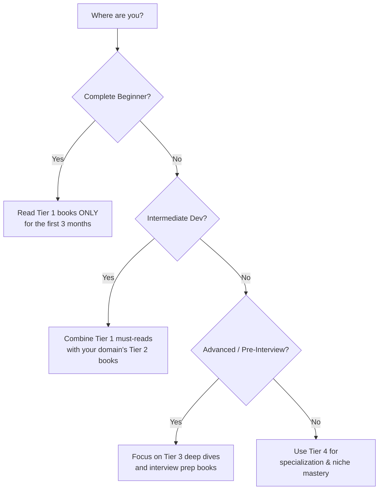
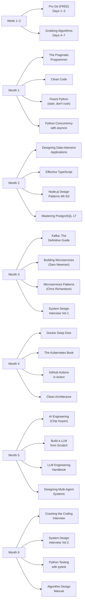

# Part 26: The Complete Book Arsenal — Every Book You Need to Become an Elite AI-Native Engineer

*[← Back to Master Index](/blog/it-career-guide)*

---

> [!IMPORTANT]
> **This is not a generic "book recommendations" post.** This is an exhaustively researched, priority-ranked, fully justified master reading list built specifically for the **AI-Native Systems Developer** career transition blueprint. Every book listed has been evaluated for relevance to the 25-part curriculum, current industry demand, ROI on time invested, and availability. Books are ordered **from the single most impactful read to the most niche specialization**, so you always know exactly what to pick up next.

---

## How to Use This Reading List

This list contains **85+ books** spanning every skill domain from Git internals to EU immigration law for tech workers. To navigate it without overwhelm:

**Reading Strategy:**
- **Tier 1 — The Non-Negotiable Eleven:** Read all 11 within the first 6 months. These transcend any single technology.
- **Tier 2 — Domain Mastery Core (30 books):** Pick 2–3 books per active learning phase aligned to your monthly blueprint schedule.
- **Tier 3 — Deep Technical Specializations (25+ books):** Read when you are actively building in that domain.
- **Tier 4 — Niche & Advanced Expertise (20+ books):** Read when you are interviewing for senior or principal roles.

---

## Tier 1: The Non-Negotiable Eleven

> [!NOTE]
> These 11 books are the backbone of every elite software engineer's library. They are technology-agnostic, career-long references. If you read nothing else, read these. They appear on nearly every "Top 10 Engineering Books" list across hundreds of surveys of senior engineers, architects, and engineering managers at top-tier global tech companies.

---

### #1 — Designing Data-Intensive Applications *(The Absolute #1)*

**Author:** Martin Kleppmann | **Publisher:** O'Reilly | **Edition:** 2nd Edition (2026)

**Why this is #1:** This is the single most important book in modern software engineering. It covers every foundational concept that separates a junior developer who knows syntax from a senior engineer who designs systems: replication, partitioning, consistency, consensus, stream processing, and the CAP theorem. Every system design interview question traces its answer back to this book. Every architecture trade-off decision you make in your career is explained here. It covers Kafka, databases, distributed transactions, and batch vs stream processing — all critical for the AI-Native blueprint.

- **Covers:** Databases (SQL/NoSQL), Replication, Partitioning, Distributed Systems, Stream Processing, CAP Theorem, Kafka concepts
- **Maps to Parts:** 7, 8, 9, 10, 11, 12
- **Estimated Read Time:** 40–50 hours
- **Cost:** ~$55 USD | Available via O'Reilly subscription
- **Priority:** 🔴 READ IMMEDIATELY

---

### #2 — The Pragmatic Programmer: Your Journey to Mastery (20th Anniversary Edition)

**Author:** Andrew Hunt & David Thomas | **Publisher:** Addison-Wesley | **Year:** 2019 (still current)

**Why this is #2:** The most important book about how to *think* like a software engineer. DRY, tracer bullets, orthogonality, broken windows theory, programming by coincidence — these mental models will improve every line of code you ever write, regardless of language or framework. In the AI era where code generation is commoditized, this book's emphasis on judgment, craftsmanship, and career ownership is more valuable than ever.

- **Covers:** Engineering Mindset, DRY, Career Philosophy, Debugging Strategy, Estimation
- **Maps to Parts:** 1, 2, 3, 21, 23, 24
- **Estimated Read Time:** 20–25 hours
- **Cost:** ~$45 USD | Also available as audiobook
- **Priority:** 🔴 READ IMMEDIATELY

---

### #3 — Clean Code: A Handbook of Agile Software Craftsmanship

**Author:** Robert C. Martin ("Uncle Bob") | **Publisher:** Prentice Hall | **Year:** 2008 (timeless)

**Why this is #3:** The gold standard for professional code quality. Teaches you to write code that reads like well-written prose — naming, functions, comments, error handling, boundaries, and unit tests. Even though AI tools can generate code quickly, production code quality depends on a developer's ability to review, refactor, and maintain. This book makes you that developer.

- **Covers:** Naming Conventions, Function Design, Comments, Error Handling, Unit Tests, Code Smells
- **Maps to Parts:** 4, 5, 6, 21
- **Estimated Read Time:** 18–22 hours
- **Priority:** 🔴 READ WITHIN FIRST MONTH

---

### #4 — System Design Interview Vol. 1 & Vol. 2

**Author:** Alex Xu | **Publisher:** ByteByteGo | **Years:** 2020, 2022

**Why this is #4:** The definitive interview preparation toolkit. Every senior engineering interview includes a system design round. These two books give you a repeatable, structured framework for approaching any design problem — from rate limiters to YouTube to distributed message queues. Use alongside the ByteByteGo newsletter for the most current case studies.

- **Covers:** URL Shortener, Chat Systems, News Feed, Rate Limiter, Notification System, S3, CDN, Web Crawler, Hotel Booking, Stock Exchange
- **Maps to Parts:** 10, 11, 23
- **Estimated Read Time:** 25–30 hours (both volumes combined)
- **Priority:** 🔴 READ BEFORE YOUR FIRST SYSTEM DESIGN INTERVIEW

---

### #5 — Fluent Python (2nd Edition)

**Author:** Luciano Ramalho | **Publisher:** O'Reilly | **Year:** 2022

**Why this is #5:** The definitive book for writing idiomatic, professional Python. Goes far beyond syntax to explain the data model, generators, coroutines, asyncio, descriptors, and class hierarchies. Every Python backend engineer needs this. After reading it, your Python code will be unrecognizable compared to beginner code — in the best way.

- **Covers:** Data Model, Sequences, Dicts/Sets, Functions as Objects, OOP, Coroutines, asyncio
- **Maps to Parts:** 4, 5
- **Estimated Read Time:** 35–40 hours
- **Priority:** 🔴 READ IN MONTH 1

---

### #6 — Clean Architecture: A Craftsman's Guide to Software Structure and Design

**Author:** Robert C. Martin | **Publisher:** Prentice Hall | **Year:** 2017

**Why this is #6:** The essential guide to structuring large codebases. SOLID principles, component coupling, use cases, hexagonal architecture — this book teaches you how to design systems that stay maintainable as they grow. Essential for anyone building production microservices or AI agent pipelines.

- **Covers:** SOLID Principles, Component Design, Architectural Boundaries, Plugins, Use Cases, Screaming Architecture
- **Maps to Parts:** 11, 12, 15, 16
- **Estimated Read Time:** 22–28 hours
- **Priority:** 🟠 READ IN MONTH 2

---

### #7 — Pro Git (2nd Edition) — FREE Online

**Author:** Scott Chacon & Ben Straub | **Publisher:** Apress | **Year:** Updated continuously

**Why this is #7:** The single best, most authoritative resource on Git, written by a GitHub co-founder. Covers the DAG, branching models, rebasing, reflog, internals, server administration, and the Git mindset. The best part: it is completely free at [git-scm.com/book](https://git-scm.com/book/en/v2).

- **Covers:** Git Internals, Branching, Rebasing, Tagging, Distributed Workflows, GitHub, Server Setup
- **Maps to Parts:** 2
- **Estimated Read Time:** 15–20 hours
- **Cost:** FREE (gitscm.com/book)
- **Priority:** 🔴 READ IN WEEK 1

---

### #8 — Grokking Algorithms: An Illustrated Guide

**Author:** Aditya Bhargava | **Publisher:** Manning | **Year:** 2016

**Why this is #8:** The most accessible, visually rich introduction to algorithms and data structures. Perfect for building intuition before tackling LeetCode. Every concept is illustrated with memorable diagrams. Read this before you open any LeetCode problem.

- **Covers:** Binary Search, Recursion, Divide & Conquer, BFS/DFS, Dijkstra's Algorithm, Dynamic Programming, K-Nearest Neighbors
- **Maps to Parts:** 22
- **Estimated Read Time:** 8–12 hours
- **Priority:** 🔴 READ IN MONTH 1

---

### #9 — Building Microservices: Designing Fine-Grained Systems (2nd Edition)

**Author:** Sam Newman | **Publisher:** O'Reilly | **Year:** 2021

**Why this is #9:** The definitive guide to microservices architecture. Sam Newman is the industry authority — no other book covers service decomposition, communication patterns, data ownership, testing, deployment, and operational concerns with the same depth and balance. Read this before you design any distributed system.

- **Covers:** Service Decomposition, APIs, Service Collaboration, Testing, Deployment, Security, Resiliency
- **Maps to Parts:** 11, 12, 13, 14
- **Estimated Read Time:** 30–35 hours
- **Priority:** 🟠 READ IN MONTH 3

---

### #10 — AI Engineering: Building Applications with Foundation Models

**Author:** Chip Huyen | **Publisher:** O'Reilly | **Year:** 2025

**Why this is #10:** The most important new book for the AI-Native engineer. Chip Huyen is the foremost authority on deploying AI systems at scale. This book covers the complete lifecycle: foundation models, RAG, evaluation, fine-tuning, deployment, monitoring, and scaling. Essential for Parts 17–19.

- **Covers:** Foundation Models, RAG, Agents, Evaluation, Fine-Tuning, LLMOps, AI Infrastructure
- **Maps to Parts:** 17, 18, 19
- **Estimated Read Time:** 30–35 hours
- **Priority:** 🟠 READ IN MONTH 5

---

### #11 — Cracking the Coding Interview (6th Edition)

**Author:** Gayle Laakmann McDowell | **Publisher:** CareerCup | **Year:** 2015 (still definitive)

**Why this is #11:** The interview preparation gold standard. Covers behavioral questions, the resume, every major algorithm category, and walk-throughs of 189 coding problems. Despite its age, the problem-solving methodologies and interview strategies are current and applicable in 2026.

- **Covers:** Big O Notation, Arrays, Strings, Linked Lists, Trees, Graphs, Recursion, DP, System Design, Behavioral
- **Maps to Parts:** 22, 23
- **Estimated Read Time:** 40–50 hours (active problem solving)
- **Priority:** 🟠 READ IN MONTH 5–6

---

## Tier 2: Domain Mastery Core

> [!NOTE]
> These are the 30 most impactful domain-specific books. Read the books matching your current monthly learning phase. Each entry maps to a specific Part in the 25-part blueprint.

---

### Phase 1 — Foundations & Python (Parts 1–5)

---

#### Python & CPython Internals

| Priority | Book | Author | Publisher | Year | Notes |
|:---:|:---|:---|:---|:---:|:---|
| ⭐⭐⭐⭐⭐ | **CPython Internals** | Anthony Shaw | Real Python | 2021 | Definitive guide to how Python executes code at the C level. GIL, bytecode, memory allocator. |
| ⭐⭐⭐⭐⭐ | **Effective Python: 90 Specific Ways** | Brett Slatkin | Addison-Wesley | 2nd Ed 2019 | 90 actionable best practices. Companion to Fluent Python. |
| ⭐⭐⭐⭐ | **Python Cookbook** | David Beazley & Brian K. Jones | O'Reilly | 3rd Ed | Recipe-style solutions to advanced Python problems. Itertools, generators, metaclasses. |
| ⭐⭐⭐⭐ | **Serious Python** | Julien Danjou | No Starch Press | 2018 | Real-world Python engineering: packaging, performance, testing, networking. |
| ⭐⭐⭐ | **Expert Python Programming** | Jaworski & Ziadé | Packt | 4th Ed 2021 | Advanced design patterns, metaprogramming, async patterns at expert level. |

#### Async Python & FastAPI

| Priority | Book | Author | Publisher | Year | Notes |
|:---:|:---|:---|:---|:---:|:---|
| ⭐⭐⭐⭐⭐ | **Python Concurrency with asyncio** | Matthew Fowler | Manning | 2022 | The definitive deep-dive on asyncio event loops, coroutines, and concurrent I/O. |
| ⭐⭐⭐⭐ | **FastAPI: Modern Python Web Development** | Bill Lubanovic | O'Reilly | 2024 | Most comprehensive FastAPI book from O'Reilly. Pydantic, async, auth, deployment. |
| ⭐⭐⭐⭐ | **Building Data Science Applications with FastAPI** | François Voron | Packt | 2nd Ed 2023 | FastAPI with ML models, security, testing, and production deployment. |

#### Git & Version Control

| Priority | Book | Author | Publisher | Year | Notes |
|:---:|:---|:---|:---|:---:|:---|
| ⭐⭐⭐⭐⭐ | **Pro Git** *(FREE)* | Chacon & Straub | Apress | Updated 2024 | The #1 Git resource. Free at git-scm.com. Read Chapter 10 for internals. |
| ⭐⭐⭐⭐ | **Version Control with Git** | Ponuthorai & Loeliger | O'Reilly | 3rd Ed 2022 | Excellent structured alternative with deep technical Git data model coverage. |
| ⭐⭐⭐ | **Mastering Git** | Jakub Narębski | Packt | 2016 | Advanced scenarios: submodules, custom hooks, repository administration. |
| ⭐⭐⭐ | **Head First Git** | Raju Gandhi | O'Reilly | 2022 | Visual, brain-friendly Git mental model builder. Best for visual learners. |

#### Linux & Developer Toolkit

| Priority | Book | Author | Publisher | Year | Notes |
|:---:|:---|:---|:---|:---:|:---|
| ⭐⭐⭐⭐⭐ | **The Linux Command Line** | William Shotts | No Starch Press | 2nd Ed 2019 | The gold standard intro to terminal mastery. Shell, pipes, I/O, scripting. Free online. |
| ⭐⭐⭐⭐ | **The Software Developer's Guide to Linux** | Cohen & Sturm | Packt | 2023 | Dev-focused: includes Git, Docker, SSH, networking alongside shell. |
| ⭐⭐⭐⭐ | **How Linux Works** | Brian Ward | No Starch Press | 3rd Ed 2021 | Boot process, kernel, memory, networking — "under the hood" Linux knowledge. |
| ⭐⭐⭐ | **Linux Command Line and Shell Scripting Bible** | Blum & Bresnahan | Wiley | 4th Ed 2021 | The most comprehensive shell scripting reference. Excellent for automation. |

---

### Phase 2 — Databases & Caching (Parts 6–10)

---

#### PostgreSQL

| Priority | Book | Author | Publisher | Year | Notes |
|:---:|:---|:---|:---|:---:|:---|
| ⭐⭐⭐⭐⭐ | **Mastering PostgreSQL 17** | Hans-Jürgen Schönig | Packt | 2024 | Most current comprehensive guide. Deep optimization, partitioning, replication. |
| ⭐⭐⭐⭐⭐ | **PostgreSQL 14 Internals** | Egor Rogov | Postgres Pro | 2023 | The definitive deep-dive into MVCC, WAL, buffer cache, vacuum, and query execution. |
| ⭐⭐⭐⭐ | **The Art of PostgreSQL** | Dimitri Fontaine | Self-Published | 2nd Ed 2021 | Production SQL patterns, schema design, and query optimization for developers. |
| ⭐⭐⭐⭐ | **PostgreSQL Query Optimization** | Dombrovskaya et al. | Apress | 2021 | Execution plans, join algorithms, index strategies for expert-level tuning. |
| ⭐⭐⭐ | **PostgreSQL 16 Administration Cookbook** | Ciolli et al. | Packt | 2023 | Recipe-based solutions for production management, HA, and replication. |

#### MongoDB & NoSQL

| Priority | Book | Author | Publisher | Year | Notes |
|:---:|:---|:---|:---|:---:|:---|
| ⭐⭐⭐⭐⭐ | **Mastering MongoDB 7.0** | Multiple Authors | Packt | 4th Ed 2024 | Most current guide. Atlas Vector Search, ACID, schema patterns, AI integration. |
| ⭐⭐⭐⭐ | **Practical MongoDB Aggregations** | Paul Done | Self-Published | 2024 | The definitive aggregation framework guide by a MongoDB Field CTO. |
| ⭐⭐⭐ | **MongoDB Data Modeling and Schema Design** | Daniel Coupal et al. | MongoDB Press | 2024 | Schema patterns aligned to access patterns — essential for document modeling. |

#### Redis

| Priority | Book | Author | Publisher | Year | Notes |
|:---:|:---|:---|:---|:---:|:---|
| ⭐⭐⭐⭐⭐ | **Redis in Action** | Josiah Carlson | Manning | 2013 | The gold standard for Redis fundamentals. Data structures, patterns, Lua scripting. |
| ⭐⭐⭐⭐ | **Redis Stack for Application Modernization** | Fugaro & Ortensi | Packt | 2023 | Modern Redis: JSON, RediSearch, time-series, and Redis as a primary database. |
| ⭐⭐⭐ | **Rediscovering Redis** | Kameron Hussain | Independently Published | 2025 | High-performance Redis architecture, scalability, and modern deployment patterns. |

#### Kafka & Event Streaming

| Priority | Book | Author | Publisher | Year | Notes |
|:---:|:---|:---|:---|:---:|:---|
| ⭐⭐⭐⭐⭐ | **Kafka: The Definitive Guide (2nd Edition)** | Shapira, Palino, Sivaram, Petty | O'Reilly | 2021 | The canonical Kafka book. Architecture, partitioning, replication, exactly-once. |
| ⭐⭐⭐⭐ | **Kafka Streams in Action (2nd Edition)** | Bill Bejeck | Manning | 2024 | Updated May 2024. Kafka Streams, Connect, Schema Registry, ksqlDB coverage. |
| ⭐⭐⭐⭐ | **Kafka in Action** | Scott, Gamov, Klein | Manning | 2021 | Hands-on pipeline building. Best for practical, project-based Kafka learning. |
| ⭐⭐⭐ | **Kafka for Architects** | Katya Gorshkova | Packt | 2026 | Enterprise patterns: CQRS, event sourcing, data contracts at scale. |

#### TypeScript & Node.js

| Priority | Book | Author | Publisher | Year | Notes |
|:---:|:---|:---|:---|:---:|:---|
| ⭐⭐⭐⭐⭐ | **Node.js Design Patterns (4th Edition)** | Casciaro & Mammino | Packt | 2025 | The definitive Node.js architecture book. ESM, TypeScript, design patterns, async. |
| ⭐⭐⭐⭐⭐ | **Effective TypeScript** | Dan Vanderkam | O'Reilly | 2nd Ed 2024 | 62 ways to use TypeScript effectively. Essential for large codebase TypeScript. |
| ⭐⭐⭐⭐ | **Programming TypeScript** | Boris Cherny | O'Reilly | 2019 | Comprehensive TypeScript: type-driven development, async, error handling. |
| ⭐⭐⭐⭐ | **Distributed Systems with Node.js** | Thomas Hunter II | O'Reilly | 2020 | Service discovery, load balancing, messaging, observability with Node. |
| ⭐⭐⭐ | **Node.js Cookbook (5th Edition)** | Griggs & Spigolon | Packt | 2024 | Updated for Node.js 22. Modern recipes replacing outdated Express patterns. |

---

### Phase 3 — DevOps, Cloud & Containers (Parts 11–15)

---

#### Microservices & DDD

| Priority | Book | Author | Publisher | Year | Notes |
|:---:|:---|:---|:---|:---:|:---|
| ⭐⭐⭐⭐⭐ | **Building Microservices** *(Listed in Tier 1)* | Sam Newman | O'Reilly | 2021 | See Tier 1 entry. |
| ⭐⭐⭐⭐⭐ | **Microservices Patterns** | Chris Richardson | Manning | 2018 | Saga, CQRS, service discovery, circuit breaker patterns in depth. |
| ⭐⭐⭐⭐ | **Monolith to Microservices** | Sam Newman | O'Reilly | 2019 | Practical migration patterns for existing codebases. Step-by-step decomposition. |
| ⭐⭐⭐⭐ | **Learning Domain-Driven Design** | Vladik Khononov | O'Reilly | 2021 | Modern DDD connecting bounded contexts directly to microservice boundaries. |
| ⭐⭐⭐⭐ | **Implementing Domain-Driven Design** | Vaughn Vernon | Addison-Wesley | 2013 | The "Red Book". Practical tactical DDD: aggregates, entities, value objects. |
| ⭐⭐⭐ | **Domain-Driven Design (The Blue Book)** | Eric Evans | Addison-Wesley | 2003 | The foundational DDD text. Dense but essential for bounded context thinking. |
| ⭐⭐⭐ | **Fundamentals of Software Architecture** | Richards & Ford | O'Reilly | 2020 | 8 architectural patterns with trade-off analysis. From microservices to space-based. |

#### Docker & Kubernetes

| Priority | Book | Author | Publisher | Year | Notes |
|:---:|:---|:---|:---|:---:|:---|
| ⭐⭐⭐⭐⭐ | **Docker Deep Dive (2025 Edition)** | Nigel Poulton | Leanpub | 2025 | The gold standard Docker book. Namespaces, images, registries, LLM Docker use. |
| ⭐⭐⭐⭐⭐ | **The Kubernetes Book (2026 Edition)** | Nigel Poulton | Leanpub | 2026 | Annually updated, always current. Covers architecture to advanced admin. |
| ⭐⭐⭐⭐ | **Kubernetes Patterns** | Ibryam & Huß | O'Reilly | 2nd Ed 2023 | Architectural patterns: Ambassador, Adapter, Operator, Sidecar. |
| ⭐⭐⭐⭐ | **Kubernetes Security and Observability** | Creane & Gupta | O'Reilly | 2022 | Security hardening and monitoring for production Kubernetes clusters. |
| ⭐⭐⭐ | **Kubernetes Cookbook** | Goasguen & Hausenblas | O'Reilly | 2023 | Recipe-based solutions for advanced networking, storage, and performance. |

#### CI/CD & DevOps

| Priority | Book | Author | Publisher | Year | Notes |
|:---:|:---|:---|:---|:---:|:---|
| ⭐⭐⭐⭐⭐ | **GitHub Actions in Action** | Kaufmann, Bos, de Vries | Manning | 2025 | The most comprehensive GitHub Actions book. Architecture, security, enterprise scale. |
| ⭐⭐⭐⭐⭐ | **The DevOps Handbook** | Kim, Humble, Debois, Willis | IT Revolution | 2nd Ed 2021 | The "Bible of DevOps". CI/CD, IaC, and organizational transformation. |
| ⭐⭐⭐⭐ | **Accelerate** | Forsgren, Humble, Kim | IT Revolution | 2018 | Data-driven proof of DevOps value. DORA metrics, deployment frequency, MTTR. |
| ⭐⭐⭐⭐ | **Continuous Delivery** | Humble & Farley | Addison-Wesley | 2010 | The foundational text for CI/CD principles. Still the most rigorous treatment. |
| ⭐⭐⭐⭐ | **Mastering GitHub Actions** | Eric Chapman | Packt | 2024 | Enterprise-scale GitHub Actions: self-hosted runners, org defaults, compliance. |
| ⭐⭐⭐ | **The Phoenix Project** | Kim, Behr, Spafford | IT Revolution | 2013 | A novel teaching DevOps principles. The most effective entry point for culture. |
| ⭐⭐⭐ | **Terraform: Up & Running (3rd Edition)** | Yevgeniy Brikman | O'Reilly | 2022 | Infrastructure as Code with Terraform. Modules, state, CI/CD integration. |
| ⭐⭐⭐ | **Infrastructure as Code** | Kief Morris | O'Reilly | 3rd Ed 2024 | Cloud infrastructure automation patterns. Multi-cloud, GitOps, immutable infra. |

#### AWS & Cloud

| Priority | Book | Author | Publisher | Year | Notes |
|:---:|:---|:---|:---|:---:|:---|
| ⭐⭐⭐⭐ | **AWS Cookbook** | Culkin & Zazon | O'Reilly | 2022 | 70+ practical AWS solutions across compute, storage, networking, security. |
| ⭐⭐⭐⭐ | **Cloud Architecture Patterns** | Bill Wilder | O'Reilly | 2012 | CQRS, event sourcing, async messaging — foundational cloud architecture patterns. |
| ⭐⭐⭐ | **Cloud Native DevOps with Kubernetes** | Garrison & Nova | O'Reilly | 2nd Ed 2023 | Cloud-native applications on Kubernetes: Helm, observability, cost optimization. |

#### gRPC & Service Mesh

| Priority | Book | Author | Publisher | Year | Notes |
|:---:|:---|:---|:---|:---:|:---|
| ⭐⭐⭐⭐ | **Protocol Buffers Handbook** | Clément Jean | Packt | 2024 | Most current Protobuf resource. Buf tooling, schema evolution, custom plugins. |
| ⭐⭐⭐ | **Istio in Depth** | Nova Trex | Independently Published | 2024 | Traffic management, security, and observability with Istio service mesh. |

---

### Phase 4 — Frontend, AI & GenAI (Parts 16–20)

---

#### React & Next.js

| Priority | Book | Author | Publisher | Year | Notes |
|:---:|:---|:---|:---|:---:|:---|
| ⭐⭐⭐⭐⭐ | **Advanced React** | Nadia Makarevich | Self-Published | 2023 | The premier senior React book. Reconciliation, performance, rendering, memory. |
| ⭐⭐⭐⭐ | **The Road to Next** | Robin Wieruch | Self-Published | 2025 | Next.js 15 + React 19: App Router, Server Actions, RSC, Dockerized Postgres. |
| ⭐⭐⭐ | **React Design Patterns and Best Practices** | Michele Bertoli | Packt | 3rd Ed 2023 | Component architecture, data flow patterns, scalable React at team level. |

#### Generative AI & LLMs

| Priority | Book | Author | Publisher | Year | Notes |
|:---:|:---|:---|:---|:---:|:---|
| ⭐⭐⭐⭐⭐ | **AI Engineering** *(Listed in Tier 1)* | Chip Huyen | O'Reilly | 2025 | See Tier 1. |
| ⭐⭐⭐⭐⭐ | **Build a Large Language Model (from Scratch)** | Sebastian Raschka | Manning | 2024 | The definitive "internals" book. Build a GPT from the ground up using PyTorch. |
| ⭐⭐⭐⭐⭐ | **The LLM Engineering Handbook** | Iusztin & Labonne | Packt | 2024 | End-to-end LLM production: RAG, fine-tuning, prompt engineering, LLMOps. |
| ⭐⭐⭐⭐ | **Hands-On Large Language Models** | Alammar & Grootendorst | O'Reilly | 2024 | Highly visual and practical. Hugging Face, LangChain, embeddings, RAG. |
| ⭐⭐⭐⭐ | **Designing Machine Learning Systems** | Chip Huyen | O'Reilly | 2022 | Production ML infrastructure, data pipelines, monitoring, scalability. |
| ⭐⭐⭐⭐ | **Building LLMs for Production** | Bouchard & Peters | Independently Published | 2024 | Latency, cost optimization, observability for production LLM systems. |
| ⭐⭐⭐ | **Prompt Engineering for LLMs** | Berryman & Ziegler | O'Reilly | 2024 | Prompt engineering as a development lifecycle discipline. Beyond basic prompting. |

#### RAG & Vector Databases

| Priority | Book | Author | Publisher | Year | Notes |
|:---:|:---|:---|:---|:---:|:---|
| ⭐⭐⭐⭐⭐ | **The LLM Engineering Handbook** *(also listed above)* | Iusztin & Labonne | Packt | 2024 | Comprehensive RAG architecture coverage. |
| ⭐⭐⭐⭐ | **RAG-Driven Generative AI** | Denis Rothman | Packt | 2024 | RAG pipeline from scratch: vector stores, chunking, indexing, hallucination reduction. |
| ⭐⭐⭐⭐ | **Generative AI with LangChain (2nd Edition)** | Auffarth & Kuligin | Packt | 2024 | LangChain + LangGraph + RAG + multi-agent in one book. Highly comprehensive. |
| ⭐⭐⭐ | **Quick Start Guide to Large Language Models** | Sinan Ozdemir | Addison-Wesley | 2024 | Fast-paced practical guide: embeddings, RAG, fine-tuning, cost trade-offs. |

#### AI Agents & LangGraph

| Priority | Book | Author | Publisher | Year | Notes |
|:---:|:---|:---|:---|:---:|:---|
| ⭐⭐⭐⭐⭐ | **Designing Multi-Agent Systems** | Victor Dibia | O'Reilly | 2025 | Written by a Microsoft AutoGen contributor. Coordination, handoffs, team structures. |
| ⭐⭐⭐⭐⭐ | **Agentic AI with LangChain & LangGraph** | Elliot R. Stroud | Packt | 2025 | End-to-end agents with LangGraph: memory, state, tool calling, orchestration. |
| ⭐⭐⭐⭐ | **Generative AI Design Patterns** | Lakshmanan & Hapke | O'Reilly | 2025 | 32 design patterns covering RAG, agents, evaluation, and deployment. |
| ⭐⭐⭐⭐ | **Learning LangChain** | Oshin & Campos | O'Reilly | 2025 | Step-by-step production AI chatbots and agents. RAG, core components, streaming. |
| ⭐⭐⭐ | **Building Applications with AI Agents** | Michael Albada | Packt | 2025 | Comparative analysis of LangGraph, LangChain, and AutoGen for agent use cases. |

#### Security & Authentication

| Priority | Book | Author | Publisher | Year | Notes |
|:---:|:---|:---|:---|:---:|:---|
| ⭐⭐⭐⭐⭐ | **OAuth 2 in Action** | Richer & Sanso | Manning | 2017 | The gold standard OAuth 2.0 book. Client, server, and resource server perspectives. |
| ⭐⭐⭐⭐ | **Solving Identity Management in Modern Applications** | Yvonne Wilson | Apress | 2nd Ed 2023 | OAuth 2.0, OIDC, SAML — the full identity lifecycle for modern developers. |
| ⭐⭐⭐ | **The Tangled Web** | Michal Zalewski | No Starch Press | 2011 | Browser security fundamentals. How authentication tokens work at the browser layer. |

---

### Phase 5 — Testing, DSA & Career (Parts 21–25)

---

#### Testing

| Priority | Book | Author | Publisher | Year | Notes |
|:---:|:---|:---|:---|:---:|:---|
| ⭐⭐⭐⭐⭐ | **Python Testing with pytest** | Brian Okken | Pragmatic Bookshelf | 3rd Ed 2024 | The definitive pytest guide. Fixtures, plugins, parametrize, conftest. |
| ⭐⭐⭐⭐⭐ | **Test-Driven Development: By Example** | Kent Beck | Addison-Wesley | 2002 | The TDD "Bible". Red-Green-Refactor cycle from the creator of TDD. |
| ⭐⭐⭐⭐ | **Growing Object-Oriented Software, Guided by Tests** | Freeman & Pryce | Addison-Wesley | 2009 | How TDD drives the design of an entire application. The "GOOS book". |
| ⭐⭐⭐⭐ | **Web Automation Testing Using Playwright** | Kailash Pathak | Packt | 2024 | E2E, API, visual testing with Playwright. CI/CD integration, shadow DOM, AI-driven. |
| ⭐⭐⭐ | **Agile Testing** | Crispin & Gregory | Addison-Wesley | 2009 | Testing strategy in Agile teams. The tester's role in modern sprints. |

#### Data Structures & Algorithms

| Priority | Book | Author | Publisher | Year | Notes |
|:---:|:---|:---|:---|:---:|:---|
| ⭐⭐⭐⭐⭐ | **Grokking Algorithms** *(Listed in Tier 1)* | Aditya Bhargava | Manning | 2016 | See Tier 1. Most visual, most accessible. |
| ⭐⭐⭐⭐⭐ | **The Algorithm Design Manual (3rd Edition)** | Steven Skiena | Springer | 2020 | Two-part: technique guide + problem catalog. Real-world algorithm selection. |
| ⭐⭐⭐⭐ | **Introduction to Algorithms (CLRS)** | Cormen, Leiserson, Rivest, Stein | MIT Press | 4th Ed 2022 | The "Bible of Algorithms". Use as a reference, not cover-to-cover. |
| ⭐⭐⭐⭐ | **Algorithms (4th Edition)** | Sedgewick & Wayne | Addison-Wesley | 2011 | Well-written academic text with Java examples and free Coursera companion. |
| ⭐⭐⭐ | **Guide to Competitive Programming** | Antti Laaksonen | Springer | 2nd Ed 2020 | Bridge between basic DSA and contest-level algorithms. CSES problem set companion. |
| ⭐⭐⭐ | **Competitive Programming 4** | Halim, Halim, Skiena, Revilla | Self-Published | 2020 | The definitive competitive programming encyclopedia for ICPC-level preparation. |

#### Interview Preparation & Career

| Priority | Book | Author | Publisher | Year | Notes |
|:---:|:---|:---|:---|:---:|:---|
| ⭐⭐⭐⭐⭐ | **System Design Interview Vol 1 & 2** *(Listed in Tier 1)* | Alex Xu | ByteByteGo | 2020, 2022 | See Tier 1. |
| ⭐⭐⭐⭐⭐ | **Cracking the Coding Interview** *(Listed in Tier 1)* | McDowell | CareerCup | 6th Ed 2015 | See Tier 1. |
| ⭐⭐⭐⭐ | **Soft Skills: The Software Developer's Life Manual** | John Sonmez | Manning | 2nd Ed 2020 | Career marketing, personal brand, productivity, remote work mindset. |
| ⭐⭐⭐⭐ | **The Complete Software Developer's Career Guide** | John Sonmez | Simple Programmer | 2017 | Freelancing, salary negotiation, specialization, interview strategy. |
| ⭐⭐⭐ | **Decode and Conquer** | Lewis C. Lin | Impact Interview | 4th Ed 2019 | STAR method for tech interviews. PM and engineering behavioral questions. |
| ⭐⭐⭐ | **Remote: Office Not Required** | DHH & Jason Fried | Crown Business | 2013 | Culture, discipline, and communication in fully remote work environments. |
| ⭐⭐⭐ | **The Passionate Programmer** | Chad Fowler | Pragmatic Bookshelf | 2009 | Career strategy: specialization, performing better, staying relevant. |

---

## Tier 3: Deep Technical Specializations

> [!TIP]
> Read these when you are actively working in the specific domain. They provide the 20% of knowledge that covers the last 80% of edge cases.

---

### Software Engineering Fundamentals

| Book | Author | Year | Why Read It |
|:---|:---|:---:|:---|
| **Refactoring: Improving Design of Existing Code (2nd Ed)** | Martin Fowler | 2018 | 72 refactoring patterns with step-by-step mechanics. The companion to Clean Code. |
| **Software Engineering at Google** | Winters, Manshreck, Wright | 2020 | How Google builds sustainable large-scale systems. Testing, CI, cultural practices. |
| **A Philosophy of Software Design** | John Ousterhout | 2nd Ed 2021 | Complexity management: deep modules, information hiding, tactical vs strategic programming. |
| **The Clean Coder** | Robert C. Martin | 2011 | Professionalism, saying no, TDD discipline, estimates, and career ethics. |
| **Working Effectively with Legacy Code** | Michael Feathers | 2004 | How to add tests to untested code and safely refactor brittle production systems. |
| **Code Complete (2nd Edition)** | Steve McConnell | 2004 | The most comprehensive book on construction techniques. Every code quality aspect. |

### Machine Learning & Deep Learning

| Book | Author | Year | Why Read It |
|:---|:---|:---:|:---|
| **Deep Learning with PyTorch (2nd Edition)** | Stevens, Antiga, Huang, Viehmann | 2024 | The gold standard PyTorch guide. From tensors to transformers. |
| **Designing Machine Learning Systems** | Chip Huyen | 2022 | Production ML infrastructure, pipelines, monitoring, and data management. |
| **Hands-On Machine Learning with Scikit-Learn, Keras, and TensorFlow** | Aurélien Géron | 3rd Ed 2022 | Comprehensive ML lifecycle: classical ML + deep learning. TensorFlow focused but essential. |
| **Deep Learning for Coders with fastai and PyTorch** | Jeremy Howard & Sylvain Gugger | 2020 | Top-down practical approach. Build first, understand mechanics after. |
| **Deep Learning (Goodfellow, Bengio, Courville)** | Goodfellow et al. | 2016 | The mathematical "Bible of Deep Learning". Essential theoretical foundation. |
| **Natural Language Processing with Transformers** | Tunstall, von Werra, Wolf | 2022 | Foundational Hugging Face transformers. Embeddings, fine-tuning, NLP tasks. |

### Distributed Systems & Reliability

| Book | Author | Year | Why Read It |
|:---|:---|:---:|:---|
| **Site Reliability Engineering (SRE Book)** | Beyer, Jones, Petoff, Murphy | 2016 | FREE online at sre.google. How Google runs production at massive scale. |
| **Database Internals** | Alex Petrov | O'Reilly 2019 | Storage engines, B-Trees, LSM trees, consensus algorithms (Raft, Paxos) in depth. |
| **Distributed Systems: Principles and Paradigms** | Tanenbaum & Van Steen | 3rd Ed 2016 | Textbook-level distributed systems. Naming, replication, consistency, fault tolerance. |
| **Patterns of Enterprise Application Architecture** | Martin Fowler | 2002 | Timeless architectural patterns: Active Record, Data Mapper, Repository, Service Layer. |
| **Release It! (2nd Edition)** | Michael Nygard | 2018 | Stability patterns: circuit breakers, bulkheads, timeouts, and production failure modes. |

### Advanced Architecture & System Design

| Book | Author | Year | Why Read It |
|:---|:---|:---:|:---|
| **Accelerate: Building and Scaling High Performance Technology Organizations** | Forsgren, Humble, Kim | 2018 | Data science of DevOps. DORA metrics and what actually predicts delivery performance. |
| **Team Topologies** | Skelton & Pais | 2019 | How to organize engineering teams around system architecture and cognitive load. |
| **Building Event-Driven Microservices** | Adam Bellemare | O'Reilly 2020 | Event-driven architecture: event sourcing, CQRS, stream processing for microservices. |
| **Reactive Design Patterns** | Kuhn, Allen, Hanafee | Manning 2017 | Reactive patterns for resilient, elastic, message-driven systems. |

### Data Engineering & Pipelines

| Book | Author | Year | Why Read It |
|:---|:---|:---:|:---|
| **Fundamentals of Data Engineering** | Reis & Housley | O'Reilly 2022 | Full data engineering lifecycle: ingestion, transformation, serving. Supports RAG systems. |
| **Data Pipelines with Apache Airflow** | Harenslak & de Ruiter | Manning 2021 | Workflow orchestration for data pipelines. Schedule, monitor, and scale DAGs. |
| **Streaming Systems** | Tyler Akidau et al. | O'Reilly 2018 | Watermarks, triggers, and correctness guarantees in streaming data processing. |

---

## Tier 4: Niche & Elite Specializations

> [!TIP]
> These books are for when you are preparing for senior/staff engineer interviews, pursuing a specific niche (like ML infrastructure or immigration), or looking for the last 5% of mastery.

---

### Blockchain, WebAssembly & Emerging Tech

| Book | Author | Year | Why Read It |
|:---|:---|:---:|:---|
| **WebAssembly: The Definitive Guide** | Brian Sletten | O'Reilly 2021 | WASM for performance-critical browser/edge code. Cloudflare Workers support. |
| **Rust Programming Language** | Klabnik & Nichols | No Starch 2nd Ed 2023 | Systems programming for performance-critical services. Memory safety without GC. |

### Career, Visa & Global Relocation

| Book | Author | Year | Why Read It |
|:---|:---|:---:|:---|
| **Work Anywhere: The Missing Manual to Remote Work** | Brie Weiler Reynolds | 2023 | Practical guide to managing international remote contracts and productivity. |
| **The $100 Startup** | Chris Guillebeau | 2012 | Freelance business strategy for technical consultants and contractors. |
| **Never Split the Difference** | Chris Voss | 2016 | Negotiation tactics by an FBI hostage negotiator. Essential for salary negotiation. |

### Performance Engineering

| Book | Author | Year | Why Read It |
|:---|:---|:---:|:---|
| **Systems Performance (2nd Edition)** | Brendan Gregg | Addison-Wesley 2020 | The definitive performance analysis book. CPU, memory, filesystem, network profiling. |
| **High Performance Python (2nd Edition)** | Gorelick & Ozsvald | O'Reilly 2020 | Profiling, Cython, NumPy optimization, concurrent processing for Python backend. |
| **BPF Performance Tools** | Brendan Gregg | Addison-Wesley 2019 | Linux eBPF for advanced kernel-level performance observability. |

### Programming Language Theory

| Book | Author | Year | Why Read It |
|:---|:---|:---:|:---|
| **Structure and Interpretation of Computer Programs (SICP)** | Abelson & Sussman | MIT Press 2nd Ed | The foundational CS text. Abstraction, recursion, interpreters, compilers. |
| **Types and Programming Languages** | Benjamin Pierce | MIT Press 2002 | Type theory and type systems. Foundational for understanding TypeScript's type system. |
| **Crafting Interpreters** | Robert Nystrom | Self-Published 2021 | Build a full interpreter from scratch. FREE online at craftinginterpreters.com. |

---

## Master Priority Matrix: Your Reading Order

Use this matrix to pick the *next* book depending on where you are in the blueprint:

---

## Quick Reference: Books by Availability & Cost

### 🆓 Free / Open Access Books

| Book | URL |
|:---|:---|
| **Pro Git** | [git-scm.com/book](https://git-scm.com/book/en/v2) |
| **The Linux Command Line** | [linuxcommand.org/tlcl.php](https://linuxcommand.org/tlcl.php) |
| **Site Reliability Engineering (Google)** | [sre.google/sre-book](https://sre.google/sre-book/table-of-contents/) |
| **Crafting Interpreters** | [craftinginterpreters.com](https://craftinginterpreters.com/) |
| **The Internals of PostgreSQL** | [interdb.jp/pg](https://interdb.jp/pg/) |
| **Competitive Programmer's Handbook** | [cses.fi/book](https://cses.fi/book/book.pdf) |
| **SICP** | [web.mit.edu/6.001/6.037/sicp.pdf](https://web.mit.edu/6.001/6.037/sicp.pdf) |

### 📚 Available via O'Reilly Subscription (TCS Perplexity Library Access)

Most O'Reilly books listed here are available through an O'Reilly Learning Platform subscription, which TCS provides access to. Check your TCS Udemy/Percipio portals first before purchasing:

- All O'Reilly-published books (Designing Data-Intensive Applications, Fluent Python, Effective TypeScript, etc.)
- Manning books (Python Concurrency with asyncio, Kafka: The Definitive Guide, etc.)
- Addison-Wesley titles (Clean Code, The Pragmatic Programmer, etc.)

### 💰 Books Worth Buying Outright (High ROI)

| Book | Why Worth Buying |
|:---|:---|
| **Designing Data-Intensive Applications** | Referenced daily as a career-long resource |
| **System Design Interview Vol 1 & 2** | Active interview prep — physical copy for annotation |
| **Cracking the Coding Interview** | Interview prep — physical copy for annotation |
| **Fluent Python** | Python career reference — annotate heavily |
| **The Algorithm Design Manual** | Problem catalog — physical reference |

---

## Final Word: The 20/80 Reading Strategy

You do not need to read every book on this list before landing your first product company role. Most successful career transitioners read **15–20 carefully chosen books** over 6 months, supplemented with official documentation, hands-on projects, and video courses.

The **20% of books that will give you 80% of the results** are:

1. **Designing Data-Intensive Applications**
2. **The Pragmatic Programmer**
3. **Pro Git** (free)
4. **Fluent Python**
5. **System Design Interview Vol. 1**
6. **Building Microservices** (Sam Newman)
7. **AI Engineering** (Chip Huyen)
8. **Python Concurrency with asyncio**
9. **Kafka: The Definitive Guide**
10. **Cracking the Coding Interview**

Read these ten. Build ten public projects. Write ten blog posts explaining what you built. You will be more hireable than 95% of candidates on any platform.

---

*[← Back to Master Index](/blog/it-career-guide)*

*[Part 1: The Blueprint & Escape Plan →](/blog/it-career-guide/part-01-the-blueprint)*
