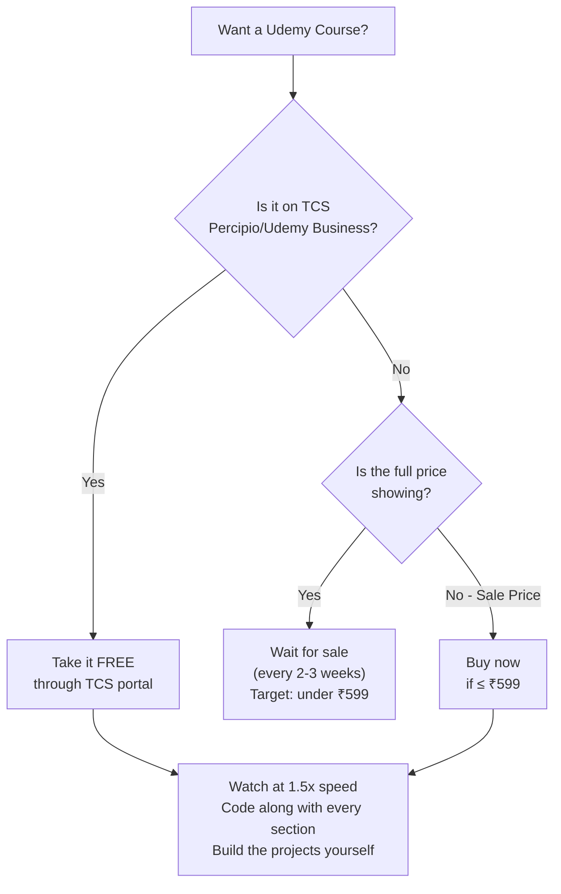

# Part 27: The Complete Udemy Course Arsenal — Every Course You Need to Become an Elite AI-Native Engineer

*[← Back to Master Index](/blog/it-career-guide)*

---

> [!IMPORTANT]
> **This is the video-learning companion to [Part 26: The Book Arsenal](/blog/it-career-guide/part-26-books-to-read).** Books give you depth and precision. Udemy courses give you visual explanations, live coding demonstrations, and guided project construction. The optimal learning strategy combines both. This list covers **90+ courses** spanning all 25 skill domains from the blueprint, plus essential **general software engineering** and **career foundation** courses that every engineer needs regardless of specialization.

---

## How Udemy Works: Before You Spend a Single Rupee

> [!TIP]
> **Udemy courses are almost NEVER worth buying at full price.** Udemy runs platform-wide sales every 2–3 weeks where courses drop from ₹3,499 to ₹399–₹599 (~$5–$8 USD). Set price alerts on courses you want, or simply wait for a sale. The TCS Percipio/Udemy Business portal also provides free access to thousands of courses — check your TCS learning portal before purchasing anything.

**Key rules for Udemy success:**
- Watch at **1.25x–1.75x speed** — most instructors speak slowly
- **Code along** — never just watch passively
- **Build the projects** — then build a variation of your own
- **Skip sections you already know** — courses are modular

---

## Tier 1: The Absolutely Essential Nine

> [!NOTE]
> These 9 courses are the non-negotiable foundation. They cover the most critical skills with the highest instructor quality and are referenced in job descriptions for backend, GenAI, and cloud roles more than any others. If you complete only these 9 courses plus their projects, you will be hireable at a product company.

---

### #1 — 100 Days of Code: The Complete Python Pro Bootcamp *(The Absolute #1)*

**Instructor:** Dr. Angela Yu | **Platform:** Udemy | **Duration:** ~60 hours | **Rating:** 4.7/5 (300K+ reviews)

**Why this is #1:** Angela Yu's 100 Days course is the most effective entry point for any aspiring backend or AI engineer. One new project every single day for 100 days builds an unshakeable muscle memory for Python syntax, debugging, and problem-solving. The scope is extraordinary: web scraping, automation, data science, Flask, APIs, games, GUI applications. It covers more practical ground than any other single course on the platform.

- **Covers:** Python fundamentals, OOP, File I/O, APIs, Flask, Pandas, Matplotlib, Selenium, Data Science
- **Maps to Parts:** 4, 5, 6
- **Who should take it:** Anyone starting from scratch or with less than 6 months of Python experience
- **After completing:** You will have 100 mini-projects for your GitHub portfolio
- **Priority:** 🔴 TAKE FIRST — START THIS WEEK

---

### #2 — The Git & GitHub Bootcamp

**Instructor:** Colt Steele | **Platform:** Udemy | **Duration:** ~17 hours | **Rating:** 4.8/5 (80K+ reviews)

**Why this is #2:** Git is used every single working day of your engineering career. Colt Steele's course is the consensus "best Git course on any platform." It covers the DAG model, interactive rebase, reflog disaster recovery, branching strategies, GitHub Actions basics, and collaborative workflows — exactly what you need for Part 2 of the blueprint. Colt's teaching style is exceptionally clear and entertaining.

- **Covers:** Git internals, branching, merging, rebasing, reflog, stashing, GitHub, SSH keys, pull requests
- **Maps to Parts:** 2
- **Priority:** 🔴 TAKE IN WEEK 1

---

### #3 — Software Architecture & Design of Modern Large Scale Systems

**Instructor:** Michael Pogrebinsky | **Platform:** Udemy | **Duration:** ~9 hours | **Rating:** 4.7/5 (40K+ reviews)

**Why this is #3:** System design is the single most differentiated skill between junior and senior engineers. Michael Pogrebinsky is the most rigorous system design instructor on Udemy. This course teaches you to design distributed systems that handle millions of requests — the exact knowledge tested in system design interviews at every product company. Read alongside Alex Xu's books.

- **Covers:** Performance, Scalability, High Availability, Load Balancing, Caching, Message Queues, Microservices, API Gateway
- **Maps to Parts:** 10, 11, 23
- **Priority:** 🔴 TAKE IN MONTH 2

---

### #4 — Apache Kafka Series — Learn Apache Kafka for Beginners v3

**Instructor:** Stéphane Maarek | **Platform:** Udemy | **Duration:** ~8 hours | **Rating:** 4.7/5 (50K+ reviews)

**Why this is #4:** Kafka is in nearly every senior backend job description. Stéphane Maarek is the undisputed Kafka authority on Udemy — his entire series is the standard recommendation across developer communities. This beginner course teaches you the exact mental model: brokers, topics, partitions, producers, consumers, offsets, and consumer groups.

- **Covers:** Kafka architecture, producers, consumers, brokers, topics, partitions, CLI tools, Java integration
- **Maps to Parts:** 9
- **Priority:** 🔴 TAKE IN MONTH 3

---

### #5 — Docker and Kubernetes: The Complete Guide

**Instructor:** Stephen Grider | **Platform:** Udemy | **Duration:** ~22 hours | **Rating:** 4.6/5 (80K+ reviews)

**Why this is #5:** Docker and Kubernetes are required skills for any cloud or backend role in 2026. Stephen Grider is an exceptional architecture instructor who explains complex container orchestration visually. This course builds a multi-container production application from scratch, including CI/CD with GitHub Actions.

- **Covers:** Docker images, containers, Compose, Kubernetes pods, deployments, services, Ingress, HTTPS, GitHub Actions CI/CD
- **Maps to Parts:** 12, 13, 14
- **Priority:** 🟠 TAKE IN MONTH 3

---

### #6 — Ultimate AWS Certified Solutions Architect Associate (SAA-C03)

**Instructor:** Stéphane Maarek | **Platform:** Udemy | **Duration:** ~27 hours | **Rating:** 4.7/5 (200K+ reviews)

**Why this is #6:** AWS is the dominant cloud platform in global tech hiring. Stéphane Maarek's SAA-C03 course is the consensus gold standard for cloud certification preparation. Even if you do not take the exam, the knowledge from this course (EC2, Lambda, RDS, DynamoDB, S3, VPC, API Gateway) is directly applicable to building production systems.

- **Covers:** EC2, Lambda, S3, RDS, DynamoDB, API Gateway, VPC, SQS/SNS, CloudFront, IAM, CloudWatch
- **Maps to Parts:** 15
- **Priority:** 🟠 TAKE IN MONTH 4

---

### #7 — Complete Generative AI Course With Langchain and Huggingface

**Instructor:** Krish Naik | **Platform:** Udemy | **Duration:** ~30 hours | **Rating:** 4.6/5 (35K+ reviews)

**Why this is #7:** GenAI engineering is the highest-demand skill category in 2026. Krish Naik is one of the most prolific and practical AI instructors on Udemy. This course covers the full production AI stack — LangChain pipelines, RAG architectures, Hugging Face models, vector databases, chatbot deployment, and OpenAI API integration.

- **Covers:** LangChain, Hugging Face, RAG, vector stores, OpenAI API, Groq, Ollama, AWS deployment
- **Maps to Parts:** 17, 18, 19
- **Priority:** 🟠 TAKE IN MONTH 5

---

### #8 — Master the Coding Interview: Data Structures + Algorithms

**Instructor:** Andrei Neagoie | **Platform:** Udemy | **Duration:** ~19 hours | **Rating:** 4.7/5 (80K+ reviews)

**Why this is #8:** You cannot pass a technical interview without DSA knowledge. Andrei Neagoie's course is the best interview-focused DSA course on Udemy. It teaches you to think like an interviewer, explains the "why" behind every data structure, and walks through FAANG-style problems with a systematic problem-solving framework.

- **Covers:** Big O Notation, Arrays, Hash Tables, Linked Lists, Trees, Graphs, Recursion, Dynamic Programming, Sorting, BFS/DFS
- **Maps to Parts:** 22, 23
- **Priority:** 🟠 TAKE IN MONTH 5

---

### #9 — GitHub Actions — The Complete Guide

**Instructor:** Maximilian Schwarzmüller | **Platform:** Udemy | **Duration:** ~14 hours | **Rating:** 4.8/5 (25K+ reviews)

**Why this is #9:** CI/CD automation is a non-negotiable DevOps skill. Maximilian Schwarzmüller (Academind) is the most comprehensive, reliable instructor on GitHub Actions. This course covers everything from basic workflow triggers to Docker builds, matrix testing, secrets management, and cloud deployment.

- **Covers:** Workflow YAML, triggers, jobs, steps, actions marketplace, Docker integration, AWS/Azure/GCP deployment, secrets, OIDC
- **Maps to Parts:** 14
- **Priority:** 🟠 TAKE IN MONTH 4

---

## Tier 2: Phase-by-Phase Domain Courses

> [!NOTE]
> Work through these in alignment with your current monthly phase in the 25-part blueprint. Each domain section lists courses from most essential to most specialized.

---

### Phase 1 Courses: Foundations & Python (Parts 1–5)

---

#### Python: Core Language & Advanced Internals

| Priority | Course | Instructor | Hours | Why Take It |
|:---:|:---|:---|:---:|:---|
| ⭐⭐⭐⭐⭐ | **100 Days of Code** *(Tier 1 #1)* | Angela Yu | 60h | See Tier 1. The #1 Python course. |
| ⭐⭐⭐⭐⭐ | **Python 3: Deep Dive (Part 1 — Functional)** | Fred Baptiste | 46h | University-level Python internals. Variables, memory, scopes, closures, decorators. No other course matches this depth. |
| ⭐⭐⭐⭐⭐ | **Python 3: Deep Dive (Part 2 — Iterators/Generators)** | Fred Baptiste | 36h | Iterators, generators, context managers, coroutines. Essential for async Python. |
| ⭐⭐⭐⭐ | **Python 3: Deep Dive (Part 4 — OOP)** | Fred Baptiste | 44h | Descriptors, properties, metaclasses, slots. Advanced OOP internals. |
| ⭐⭐⭐⭐ | **Complete Python Developer: Zero to Mastery** | Andrei Neagoie | 30h | Career-focused alternative to Angela Yu's course. Strong emphasis on professional tooling and workflows. |
| ⭐⭐⭐⭐ | **Python Data Structures & Algorithms + LEETCODE Exercises** | Scott Barrett | 20h | Python-native DSA with integrated LeetCode exercises. Best for Python-focused interview prep. |

#### Async Python & FastAPI

| Priority | Course | Instructor | Hours | Why Take It |
|:---:|:---|:---|:---:|:---|
| ⭐⭐⭐⭐⭐ | **FastAPI — The Complete Course 2026 (Beginner + Advanced)** | Various | 22h | Most current and comprehensive FastAPI course. Covers async, SQLAlchemy, Pydantic v2, OAuth2, Docker. |
| ⭐⭐⭐⭐ | **FastAPI Mastery: Build Modern APIs with Python** | Various | 15h | Strong async focus. Background tasks, WebSockets, Uvicorn/Gunicorn production deployment. |
| ⭐⭐⭐⭐ | **Complete FastAPI Masterclass from Scratch** | Various | 18h | In-depth request/response validation, async DB operations with asyncpg/PostgreSQL. |
| ⭐⭐⭐ | **Python Concurrency with asyncio** | Various | 8h | Event loop mechanics, `asyncio`, `aiohttp`, concurrent I/O patterns in Python. |

#### Git & Version Control

| Priority | Course | Instructor | Hours | Why Take It |
|:---:|:---|:---|:---:|:---|
| ⭐⭐⭐⭐⭐ | **The Git & GitHub Bootcamp** *(Tier 1 #2)* | Colt Steele | 17h | See Tier 1. The definitive Git course. |
| ⭐⭐⭐ | **Git & GitHub For Beginners — Master Git and GitHub (2025)** | Various | 6h | Shorter alternative for complete beginners who need a faster on-ramp. |

#### Linux, Terminal & Developer Toolkit

| Priority | Course | Instructor | Hours | Why Take It |
|:---:|:---|:---|:---:|:---|
| ⭐⭐⭐⭐⭐ | **Linux Command Line Bootcamp** | Colt Steele | 15h | Best Linux terminal course for developers on Udemy. Practical, not theoretical. Essential for WSL2 users on Windows. |
| ⭐⭐⭐⭐ | **Bash Scripting and Shell Programming** | Jason Cannon | 6h | Automation scripts, cron jobs, error handling. Exactly the shell scripting needed for DevOps workflows. |
| ⭐⭐⭐⭐ | **Linux Administration Bootcamp** | Jason Cannon | 12h | Full sysadmin skills: permissions, networking, package management, process control. |
| ⭐⭐⭐ | **Complete Linux Training Course** | Imran Afzal | 30h | Deepest Linux course on Udemy. Enterprise topics: LVM, NFS, LDAP. For DevOps/SRE tracks. |

---

### Phase 2 Courses: Databases & Messaging (Parts 6–10)

---

#### TypeScript & Node.js

| Priority | Course | Instructor | Hours | Why Take It |
|:---:|:---|:---|:---:|:---|
| ⭐⭐⭐⭐⭐ | **Understanding TypeScript (2025/2026 Edition)** | Maximilian Schwarzmüller | 22h | The most comprehensive TypeScript course. Generics, decorators, mixins, namespaces, advanced types. |
| ⭐⭐⭐⭐⭐ | **Node.js, Express, MongoDB & More: The Complete Bootcamp** | Jonas Schmedtmann | 42h | The highest-quality Node.js course. Deep Express, MongoDB, authentication, REST API design, deployment. |
| ⭐⭐⭐⭐ | **TypeScript Masterclass 2025/2026 Edition** | Various | 18h | Full TypeScript API with Node.js, Express, and MongoDB from scratch. |
| ⭐⭐⭐⭐ | **TypeScript: The Complete Developer's Guide** | Stephen Grider | 24h | Strongly architecture-focused TypeScript. Design patterns, decorators, project structure. |
| ⭐⭐⭐ | **JavaScript — The Complete Guide 2025** | Maximilian Schwarzmüller | 52h | The deepest JS foundation course. If you are weak on JS fundamentals before TypeScript, start here. |

#### PostgreSQL & SQL

| Priority | Course | Instructor | Hours | Why Take It |
|:---:|:---|:---|:---:|:---|
| ⭐⭐⭐⭐⭐ | **SQL and PostgreSQL: The Complete Developer's Guide** | Stephen Grider | 22h | Hardware-level storage understanding, query tuning, schema design, application integration. Best for developers. |
| ⭐⭐⭐⭐⭐ | **The Complete SQL Bootcamp: Go from Zero to Hero** | Jose Portilla | 9h | The most popular SQL course. pgAdmin, CRUD, joins, subqueries, window functions. Perfect foundation. |
| ⭐⭐⭐⭐ | **PostgreSQL Bootcamp: Go From Beginner To Advanced (60+ Hours)** | Various | 62h | The most exhaustive PostgreSQL course. CTEs, window functions, JSON, PL/pgSQL, triggers, performance tuning. |
| ⭐⭐⭐ | **SQL and PostgreSQL for Beginners: Become a SQL Expert** | Various | 12h | Strong focus on data analysis: complex joins, subqueries, relationships, practical challenges. |
| ⭐⭐⭐ | **The Ultimate MySQL Bootcamp** | Colt Steele | 20h | SQL fundamentals using MySQL. Good if you encounter MySQL at your company (TCS projects often use MySQL). |

#### MongoDB

| Priority | Course | Instructor | Hours | Why Take It |
|:---:|:---|:---|:---:|:---|
| ⭐⭐⭐⭐⭐ | **MongoDB — The Complete Developer's Guide** | Maximilian Schwarzmüller | 17h | The gold standard MongoDB course on Udemy. CRUD, aggregation framework, indexes, performance, Atlas. |
| ⭐⭐⭐⭐ | **The Complete Developers Guide to MongoDB (NodeJS Focused)** | Stephen Grider | 13h | TDD-focused, Mongoose-heavy. Best for Node.js developers integrating MongoDB into production APIs. |
| ⭐⭐⭐ | **Node.js, Express, MongoDB & More** *(listed above)* | Jonas Schmedtmann | 42h | Includes production-grade MongoDB integration in a full-stack context. |

#### Redis

| Priority | Course | Instructor | Hours | Why Take It |
|:---:|:---|:---|:---:|:---|
| ⭐⭐⭐⭐⭐ | **Redis: The Complete Developer's Guide** | Stephen Grider | 17h | The gold standard Redis course. Advanced data structures, clustering, Lua scripting, Redis modules. Bestseller. |
| ⭐⭐⭐⭐ | **Master Redis — From Beginner to Advanced (20+ hours)** | Various | 22h | Deepest Redis course on Udemy. RedisJSON, RediSearch, administration, replication, clustering. |

#### Apache Kafka

| Priority | Course | Instructor | Hours | Why Take It |
|:---:|:---|:---|:---:|:---|
| ⭐⭐⭐⭐⭐ | **Apache Kafka Series — Learn Apache Kafka for Beginners v3** *(Tier 1 #4)* | Stéphane Maarek | 8h | See Tier 1. The definitive Kafka starting point. |
| ⭐⭐⭐⭐⭐ | **Kafka Streams for Data Processing** | Stéphane Maarek | 8h | Stream processing APIs, state stores, KTables, windowing, exactly-once semantics. |
| ⭐⭐⭐⭐ | **Confluent Schema Registry & Kafka REST Proxy** | Stéphane Maarek | 3h | Schema management in production Kafka environments. Avro, serialization, backward/forward compatibility. |
| ⭐⭐⭐⭐ | **Kafka Connect Hands On Learning** | Stéphane Maarek | 4h | Integrate Kafka with databases, Elasticsearch, S3. Source/sink connector configuration. |
| ⭐⭐⭐ | **Kafka Cluster Setup & Administration** | Stéphane Maarek | 5h | Production Kafka operations: cluster deployment, monitoring, performance tuning, security. |

---

### Phase 3 Courses: DevOps, Cloud & Containers (Parts 11–15)

---

#### Microservices Architecture

| Priority | Course | Instructor | Hours | Why Take It |
|:---:|:---|:---|:---:|:---|
| ⭐⭐⭐⭐⭐ | **Design Microservices Architecture with Patterns & Principles** | Michael Pogrebinsky | 12h | The best architectural thinking course for microservices. Decomposition, event-driven patterns, monolith evolution. |
| ⭐⭐⭐⭐⭐ | **The Complete Microservices & Event-Driven Architecture** | Michael Pogrebinsky | 16h | Deep event-driven architecture: CQRS, event sourcing, SAGA, outbox pattern. |
| ⭐⭐⭐⭐ | **Microservices: Clean Architecture, DDD, SAGA, Outbox & Kafka** | Various | 20h | DDD tactical patterns, SAGA distributed transactions, Kafka-powered event pipelines. |
| ⭐⭐⭐ | **Software Architecture & System Design Practical Case Studies** | Michael Pogrebinsky | 8h | Real-world architecture case studies for interview preparation. |

#### Docker & Kubernetes

| Priority | Course | Instructor | Hours | Why Take It |
|:---:|:---|:---|:---:|:---|
| ⭐⭐⭐⭐⭐ | **Docker and Kubernetes: The Complete Guide** *(Tier 1 #5)* | Stephen Grider | 22h | See Tier 1. The best combined Docker+K8s course. |
| ⭐⭐⭐⭐⭐ | **Kubernetes for the Absolute Beginners — Hands-on** | Mumshad Mannambeth | 6h | The most beginner-friendly Kubernetes course. Browser-based labs, KodeKloud integration. |
| ⭐⭐⭐⭐⭐ | **Certified Kubernetes Administrator (CKA) with Practice Tests** | Mumshad Mannambeth | 18h | Gold standard CKA exam prep. Comprehensive coverage, exhaustive practice labs. |
| ⭐⭐⭐⭐ | **Docker for the Absolute Beginner — Hands-On — DevOps** | Mumshad Mannambeth | 4h | Clean Docker fundamentals with browser labs. Best standalone Docker beginner course. |
| ⭐⭐⭐ | **Learn Kubernetes Practically** | Various | 12h | Advanced K8s: Helm, operators, custom resources, RBAC, network policies. |

#### CI/CD & GitHub Actions

| Priority | Course | Instructor | Hours | Why Take It |
|:---:|:---|:---|:---:|:---|
| ⭐⭐⭐⭐⭐ | **GitHub Actions — The Complete Guide** *(Tier 1 #9)* | Maximilian Schwarzmüller | 14h | See Tier 1. The comprehensive GitHub Actions course. |
| ⭐⭐⭐⭐ | **Hands-On CI/CD with GitHub Actions | Absolute Practical** | Various | 10h | Enterprise-level: self-hosted runners, Kubernetes deployments, ARC, Helm integration. |
| ⭐⭐⭐⭐ | **Learn Github Actions for CI/CD DevOps Pipelines** | Houssem Dellai | 8h | DevSecOps patterns, Terraform/Bicep integration, Azure cloud deployment. |
| ⭐⭐⭐ | **Master GitHub Actions for DevOps: CI/CD with Real Projects** | Various | 8h | Portfolio-building: three real projects with Docker and S3 static hosting. |

#### Infrastructure as Code & Terraform

| Priority | Course | Instructor | Hours | Why Take It |
|:---:|:---|:---|:---:|:---|
| ⭐⭐⭐⭐⭐ | **Learn DevOps: Infrastructure Automation With Terraform** | Edward Viaene | 16h | Terraform integrated with AWS, Packer, Docker, Jenkins, Kubernetes. Real DevOps workflow. |
| ⭐⭐⭐⭐ | **HashiCorp Certified: Terraform Associate** | Zeal Vora | 14h | Certification-focused with strong fundamentals. State management, modules, backends. |
| ⭐⭐⭐⭐ | **Terraform for the Absolute Beginners with Labs** | KodeKloud / Mumshad | 4h | Browser-based labs. Cleanest beginner path for IaC. |
| ⭐⭐⭐ | **Terraform on AWS with SRE & IaC DevOps (Real-World Demos)** | Various | 12h | AWS-specific SRE: 3-tier architectures, load balancers, CI/CD for infrastructure. |

#### AWS Cloud

| Priority | Course | Instructor | Hours | Why Take It |
|:---:|:---|:---|:---:|:---|
| ⭐⭐⭐⭐⭐ | **Ultimate AWS Certified Solutions Architect Associate (SAA-C03)** *(Tier 1 #6)* | Stéphane Maarek | 27h | See Tier 1. The gold standard cloud foundations course. |
| ⭐⭐⭐⭐⭐ | **Ultimate AWS Certified Developer Associate (DVA-C02)** | Stéphane Maarek | 26h | Developer-focused AWS: Lambda, DynamoDB, API Gateway, SAM, CodePipeline. |
| ⭐⭐⭐⭐ | **AWS Certified Developer Associate Exam Training** | Neal Davis | 20h | Coding-heavy alternative to Maarek. Excellent for learning-by-building approach. |
| ⭐⭐⭐ | **AWS Lambda & Serverless Architecture Bootcamp** | Various | 15h | Deep serverless: Lambda, API Gateway, DynamoDB, SQS, EventBridge, Step Functions. |

#### API Design: REST, GraphQL & gRPC

| Priority | Course | Instructor | Hours | Why Take It |
|:---:|:---|:---|:---:|:---|
| ⭐⭐⭐⭐ | **REST API vs GraphQL vs gRPC — The Complete Guide** | Various | 10h | Decision-making framework for choosing the right API protocol. Trade-offs, use cases. |
| ⭐⭐⭐⭐ | **REST API Design, Development & Management** | Various | 8h | API versioning, security, documentation (Swagger/OpenAPI), rate limiting, best practices. |
| ⭐⭐⭐ | **gRPC [Golang] Master Class: Build Modern API & Microservices** | Various | 8h | High-performance gRPC and Protocol Buffers with Go. Production inter-service communication. |

---

### Phase 4 Courses: Frontend & AI/GenAI (Parts 16–20)

---

#### React & Next.js

| Priority | Course | Instructor | Hours | Why Take It |
|:---:|:---|:---|:---:|:---|
| ⭐⭐⭐⭐⭐ | **React — The Complete Guide (incl. Next.js, Redux)** | Maximilian Schwarzmüller | 68h | The most comprehensive React course. Hooks, Context, Redux, Next.js 14+, React Query. |
| ⭐⭐⭐⭐⭐ | **Next.js & React — The Complete Guide** | Maximilian Schwarzmüller | 36h | Deep Next.js 15+ focus: App Router, Server Components, Server Actions, RSC, SSR/SSG. |
| ⭐⭐⭐⭐ | **Modern React with Redux** | Stephen Grider | 52h | Architecture-first approach to React+Redux. Highly praised for explaining "why" Redux is structured the way it is. |
| ⭐⭐⭐⭐ | **Next.js: The Complete Developer's Guide** | Stephen Grider | 24h | Alternative Next.js deep-dive with strong architectural focus. |
| ⭐⭐⭐ | **The Complete JavaScript Course 2025: From Zero to Expert** | Jonas Schmedtmann | 69h | The deepest JS course on Udemy. Essential if you need rock-solid JS fundamentals before React. |

#### Generative AI, LLMs & RAG

| Priority | Course | Instructor | Hours | Why Take It |
|:---:|:---|:---|:---:|:---|
| ⭐⭐⭐⭐⭐ | **Complete Generative AI Course With Langchain and Huggingface** *(Tier 1 #7)* | Krish Naik | 30h | See Tier 1. The best production GenAI course on Udemy. |
| ⭐⭐⭐⭐⭐ | **AI & LLM Engineering Mastery: GenAI, RAG Complete Guide** | Various | 25h | Structured LLM engineer path: RAG, vector databases, fine-tuning with LoRA/QLoRA. |
| ⭐⭐⭐⭐ | **Machine Learning A-Z™: AI, Python & R + ChatGPT Prize [2025]** | Kirill Eremenko, Hadelin de Ponteves | 44h | Nearly 1 million students. Classical ML + deep learning foundation. Best breadth-first course. |
| ⭐⭐⭐⭐ | **Complete A.I. & Machine Learning, Data Science Bootcamp** | Andrei Neagoie | 43h | Balanced theory + hands-on ML projects. Strong career-focus framing. |
| ⭐⭐⭐⭐ | **Python for Data Science and Machine Learning Bootcamp** | Jose Portilla | 25h | Masters the Python ML stack: Pandas, NumPy, Matplotlib, Scikit-learn, Seaborn. |
| ⭐⭐⭐ | **Mathematical Foundations of Machine Learning** | Various | 18h | Linear algebra and calculus for ML. Essential if you plan to understand neural network math. |
| ⭐⭐⭐ | **Statistics for Data Science and Business Analysis** | Various | 7h | Hypothesis testing, distributions, regression, p-values for data-driven ML decisions. |

#### AI Agents, LangChain & LangGraph

| Priority | Course | Instructor | Hours | Why Take It |
|:---:|:---|:---|:---:|:---|
| ⭐⭐⭐⭐⭐ | **Build AI Agents with LangChain and LangGraph** | Eden Marco | 16h | The bestseller LangGraph course. RAG, tool calling, MCP, production workflows. Written by a top AI practitioner. |
| ⭐⭐⭐⭐⭐ | **Production AI Agents with LangChain + LangGraph** | Various | 20h | Production patterns: multi-agent systems, FastAPI deployment, Docker, testing, LangSmith observability. |
| ⭐⭐⭐⭐ | **LangChain — Develop LLM Powered Applications with LangChain** | Various | 14h | LangChain fundamentals: chains, prompt templates, memory, agents, RAG projects. Regularly updated. |
| ⭐⭐⭐⭐ | **LangChain Mastery: Build GenAI Apps with LangChain & Pinecone** | Various | 12h | Deep RAG + vector database integration. Pinecone, embedding optimization, document chunking. |
| ⭐⭐⭐ | **The AI Engineer Course 2025: Complete AI Engineer Bootcamp** | Various | 30h | LLMs, vector DBs, LangChain, RAG, AI deployment. Career-focused framing. |

#### Web Security & Authentication

| Priority | Course | Instructor | Hours | Why Take It |
|:---:|:---|:---|:---:|:---|
| ⭐⭐⭐⭐⭐ | **Web Security & Bug Bounty: Learn Penetration Testing** | Various | 12h | SQL injection, XSS, broken access control, Burp Suite. Real penetration testing skills. |
| ⭐⭐⭐⭐ | **OWASP TOP 10:2025 — Comprehensive Training** | Various | 8h | All 10 OWASP categories, JWT verification, CI/CD pipeline security, 60+ real code examples. |
| ⭐⭐⭐⭐ | **Mastering API Security for Pentesting & Bug Bounties 2025** | Various | 10h | OWASP API Security Top 10, OAuth 2.0, JWT exploitation and defense. |
| ⭐⭐⭐ | **Advanced OAuth Security** | Various | 6h | FAPI extensions, DPoP, MTLS, advanced JWT security patterns. For security specialists. |

---

### Phase 5 Courses: Testing, DSA & Career (Parts 21–25)

---

#### Software Testing

| Priority | Course | Instructor | Hours | Why Take It |
|:---:|:---|:---|:---:|:---|
| ⭐⭐⭐⭐⭐ | **Playwright Python and Pytest for Web Automation Testing** | Various | 14h | Page Object Model, parallel execution, CI/CD integration, API + UI testing. Most current E2E course. |
| ⭐⭐⭐⭐ | **Playwright PYTHON Automation Testing — From Zero to Expert** | Various | 18h | Full Python/Pytest foundation + web automation, network mocking, advanced framework design. |
| ⭐⭐⭐⭐ | **Unit Testing And Test Driven Development In Python** | Various | 8h | TDD Red-Green-Refactor with Python. Unittest, pytest, mocking, test isolation. |
| ⭐⭐⭐ | **Test Driven Development: Build software with confidence** | Various | 6h | TDD methodology: Obvious Implementation, Triangulation. Framework-agnostic conceptual course. |

#### Data Structures & Algorithms

| Priority | Course | Instructor | Hours | Why Take It |
|:---:|:---|:---|:---:|:---|
| ⭐⭐⭐⭐⭐ | **Master the Coding Interview: Data Structures + Algorithms** *(Tier 1 #8)* | Andrei Neagoie | 19h | See Tier 1. The best interview-focused DSA course. |
| ⭐⭐⭐⭐⭐ | **JavaScript Algorithms and Data Structures Masterclass** | Colt Steele | 22h | Clear animations, deep problem-solving pattern explanations. Best for JS developers. |
| ⭐⭐⭐⭐ | **Python Data Structures & Algorithms + LEETCODE Exercises** | Scott Barrett | 20h | Python-native DSA with integrated LeetCode-style exercises. Best for Python developers. |
| ⭐⭐⭐⭐ | **Data Structures & Algorithms, Level-up for Coding Interviews** | Prateek Narang (Google Engineer) | 26h | Pattern recognition, optimization strategies. Ideal for Big Tech interview preparation. |
| ⭐⭐⭐ | **Mastering Data Structures & Algorithms using C and C++** | Abdul Bari | 59h | The legendary "from scratch" DSA course. Deep mechanical understanding of every data structure. |

#### System Design & Interview Preparation

| Priority | Course | Instructor | Hours | Why Take It |
|:---:|:---|:---|:---:|:---|
| ⭐⭐⭐⭐⭐ | **Software Architecture & Design of Modern Large Scale Systems** *(Tier 1 #3)* | Michael Pogrebinsky | 9h | See Tier 1. |
| ⭐⭐⭐⭐⭐ | **Mastering the System Design Interview** | Frank Kane (ex-Amazon) | 14h | Interview-specific: hiring manager perspective, FAANG/MAANG patterns, structured frameworks. |
| ⭐⭐⭐⭐ | **Pragmatic System Design** | Alexey Soshin | 8h | Concise core concepts: concurrency, SQL vs NoSQL, sharding, Netflix/Yelp case studies. |
| ⭐⭐⭐ | **Rocking System Design** | Rajdeep Saha | 12h | AWS-integrated system design. Lambda, API Gateway, Kubernetes in real architectures. |
| ⭐⭐⭐ | **Master Microservices with Spring Boot, Docker, Kubernetes** | Various | 30h | Full microservices stack: Spring Boot, Docker, Kubernetes, Spring Cloud. Java-focused. |

#### Career, Freelancing & Remote Work

| Priority | Course | Instructor | Hours | Why Take It |
|:---:|:---|:---|:---:|:---|
| ⭐⭐⭐⭐ | **Freelancing Mastery: Earn, Work Remotely & Scale** | Various | 8h | Build a freelance business, manage projects, scale revenue. Platform strategies for Upwork/Toptal. |
| ⭐⭐⭐⭐ | **Salary Negotiation Pro Masterclass — Get The Salary You Desire** | Various | 4h | Preparation, framing results, handling objections. Worth 10x its price at the first salary discussion. |
| ⭐⭐⭐ | **Remote Work & Freelancing: Find a Remote Job and Work Online** | Various | 6h | Landing remote jobs, standout resumes for remote roles, digital nomad lifestyle setup. |
| ⭐⭐⭐ | **Fiverr & ChatGPT & AI Powered Freelancing Mega-Masterclass** | Various | 10h | Combines freelancing platform strategy with AI tools to boost efficiency and service offerings. |

---

## Tier 3: General Software Engineering Courses Every Engineer Needs

> [!IMPORTANT]
> These courses are **not specific to the 25-part blueprint** but are essential for any professional software or AI engineer. They cover the craft of engineering itself — architecture patterns, code quality, clean code, and computer science foundations.

---

### Software Architecture & Design Patterns

| Priority | Course | Instructor | Hours | Why Take It |
|:---:|:---|:---|:---:|:---|
| ⭐⭐⭐⭐⭐ | **Low-Level System Design, Design Patterns & SOLID Principles** | Various | 18h | Bestseller. LLD, all 23 Gang of Four patterns, SOLID applied to real code. Essential for code review quality. |
| ⭐⭐⭐⭐⭐ | **Ultimate Clean Code Masterclass** | Various | 14h | Real-world refactoring case studies, in-browser challenges, SOLID principles. Best Clean Code course on Udemy. |
| ⭐⭐⭐⭐ | **Software Architectures (SOLID) & Design Patterns in Java** | Various | 16h | Creational, behavioral, structural patterns + SOLID + architecture styles. Broad pattern foundation. |
| ⭐⭐⭐⭐ | **The Complete Microservices & Event-Driven Architecture** *(also listed above)* | Michael Pogrebinsky | 16h | Distributed system design patterns. Event-driven, CQRS, outbox. |
| ⭐⭐⭐ | **Software Architecture & System Design Practical Case Studies** | Michael Pogrebinsky | 8h | Apply architectural patterns to real interview scenarios. |

### Computer Science Fundamentals

| Priority | Course | Instructor | Hours | Why Take It |
|:---:|:---|:---|:---:|:---|
| ⭐⭐⭐⭐⭐ | **The Web Developer Bootcamp** | Colt Steele | 74h | The gold standard full-stack bootcamp. HTML, CSS, JavaScript, Node.js, Express, MongoDB. If you are starting from zero in web dev, this is Course #1. |
| ⭐⭐⭐⭐ | **The Complete Web Development Bootcamp** | Dr. Angela Yu | 65h | Similar breadth to Colt Steele's bootcamp with her characteristic engaging teaching style. React, Node.js, SQL/NoSQL. |
| ⭐⭐⭐⭐ | **Computer Science 101: Master the Theory Behind Programming** | Various | 12h | How computers actually work — binary, memory, CPU, networking. Fills CS gaps for self-taught developers. |
| ⭐⭐⭐ | **Complete A.I. & Machine Learning, Data Science Bootcamp** *(also above)* | Andrei Neagoie | 43h | CS + ML combined. Good as a general "applied computer science" course. |

### Mathematics for AI Engineers

| Priority | Course | Instructor | Hours | Why Take It |
|:---:|:---|:---|:---:|:---|
| ⭐⭐⭐⭐⭐ | **Mathematical Foundations of Machine Learning** | Various | 18h | Linear algebra + calculus specifically for ML. Bridges theory and library implementation. |
| ⭐⭐⭐⭐ | **Complete Math, Statistics & Probability for Machine Learning** | Various | 32h | Comprehensive: set theory, combinatorics, linear algebra, probability, statistics. Most thorough math course. |
| ⭐⭐⭐⭐ | **Statistics for Data Science and Business Analysis** | Various | 7h | Applied stats: hypothesis testing, regression, distributions. Python-integrated. |
| ⭐⭐⭐ | **Become a Probability and Statistics Master** | Various | 16h | Deep probability: Bayes' theorem, distributions, inferential statistics. |

---

## Tier 4: Top Instructor Signature Courses Reference

> [!TIP]
> These are the "signature" courses from Udemy's most trusted instructors — courses so well-produced that enrollment in any of them is a safe decision regardless of your current level.

---

### Colt Steele — Best Courses

| Course | Why It's Trusted |
|:---|:---|
| **The Web Developer Bootcamp** | Gold standard beginner web dev. 74h, constantly updated. |
| **The Git & GitHub Bootcamp** | Gold standard Git course on any platform. |
| **JavaScript Algorithms and Data Structures Masterclass** | Best animation-driven DSA course. |
| **The Linux Command Line Bootcamp** | Best developer-focused Linux terminal course. |
| **The Ultimate MySQL Bootcamp** | Most popular SQL/MySQL learning resource on Udemy. |

### Maximilian Schwarzmüller (Academind) — Best Courses

| Course | Why It's Trusted |
|:---|:---|
| **React — The Complete Guide** | Most comprehensive React course. Always updated for latest APIs. |
| **Next.js & React — The Complete Guide** | Best dedicated Next.js course on Udemy. |
| **Understanding TypeScript** | Deepest TypeScript language coverage available. |
| **GitHub Actions — The Complete Guide** | The definitive CI/CD with GitHub Actions resource. |
| **JavaScript — The Complete Guide** | 52 hours. The deepest JS foundation course on Udemy. |

### Stephen Grider — Best Courses

| Course | Why It's Trusted |
|:---|:---|
| **Docker and Kubernetes: The Complete Guide** | Best combined container orchestration course. Architecture-first approach. |
| **Modern React with Redux** | Most architecture-focused React course. Explains Redux patterns thoroughly. |
| **SQL and PostgreSQL: The Complete Developer's Guide** | Hardware-level storage + application integration. Developer-focused. |
| **TypeScript: The Complete Developer's Guide** | Design patterns + TypeScript. Career-focused. |
| **MongoDB — The Complete Developer's Guide** *(listed under Maximilian — same platform)* | - |

### Stéphane Maarek — Best Courses

| Course | Why It's Trusted |
|:---|:---|
| **Apache Kafka Series (entire series)** | The undisputed Kafka authority on Udemy. Every course in the series is excellent. |
| **Ultimate AWS Certified Solutions Architect Associate** | Gold standard AWS certifications prep. 200K+ students. |
| **Ultimate AWS Certified Developer Associate** | Developer-focused AWS. Lambda, DynamoDB, CodePipeline. |

### Andrei Neagoie (Zero to Mastery) — Best Courses

| Course | Why It's Trusted |
|:---|:---|
| **Master the Coding Interview: Data Structures + Algorithms** | Best interview-focused DSA with FAANG mindset approach. |
| **The Complete Python Developer** | Career-switcher focused Python course. Professional workflows. |
| **Complete A.I. & Machine Learning, Data Science Bootcamp** | Balanced ML fundamentals + career preparation. |

### Mumshad Mannambeth (KodeKloud) — Best Courses

| Course | Why It's Trusted |
|:---|:---|
| **Certified Kubernetes Administrator (CKA) with Practice Tests** | Gold standard CKA certification prep. Browser-based KodeKloud labs. |
| **Kubernetes for the Absolute Beginners — Hands-on** | Best beginner K8s course. Zero local setup required. |
| **Docker for the Absolute Beginner — Hands-On — DevOps** | Cleanest Docker beginner path with practical labs. |
| **Terraform for the Absolute Beginners with Labs** | Best beginner IaC course. Browser-based Terraform labs. |

### Michael Pogrebinsky — Best Courses

| Course | Why It's Trusted |
|:---|:---|
| **Software Architecture & Design of Modern Large Scale Systems** | Most rigorous system design course on Udemy. |
| **The Complete Microservices & Event-Driven Architecture** | Best event-driven microservices architecture course. |
| **Design Microservices Architecture with Patterns & Principles** | Best microservices decomposition and patterns course. |

---

## The 12-Course "Career Change Sprint" Reading Order

If you want the tightest possible 6-month curriculum that gets you interview-ready at a product company, take exactly these 12 courses in this order:

```mermaid
graph TD
    W1["Week 1"] --> C1["The Git & GitHub Bootcamp\n(Colt Steele) — 17h"]
    W2["Week 2-5"] --> C2["100 Days of Code\n(Angela Yu) — 60h\nFirst 50 days only"]
    M2["Month 2"] --> C3["Python 3: Deep Dive Part 1\n(Fred Baptiste) — 46h"]
    M2 --> C4["SQL & PostgreSQL: Complete\nDeveloper's Guide (Grider) — 22h"]
    M3["Month 3"] --> C5["FastAPI Complete Course 2026 — 22h"]
    M3 --> C6["Redis: Complete Developer's Guide\n(Grider) — 17h"]
    M3 --> C7["Apache Kafka Beginners v3\n(Maarek) — 8h"]
    M4["Month 4"] --> C8["Docker & Kubernetes: Complete Guide\n(Grider) — 22h"]
    M4 --> C9["GitHub Actions: Complete Guide\n(Schwarzmüller) — 14h"]
    M5["Month 5"] --> C10["Ultimate AWS SAA-C03\n(Maarek) — 27h"]
    M5 --> C11["Complete GenAI Course\nLangChain+HuggingFace (Krish Naik) — 30h"]
    M6["Month 6"] --> C12["Master the Coding Interview\n(Andrei Neagoie) — 19h"]
    M6 --> C13["Mastering the System Design\nInterview (Frank Kane) — 14h"]
```

**Total: ~338 hours across 6 months = ~56 hours/month = ~14 hours/week**

---

## Quick Reference: Course Cost Strategy

### ✅ Available FREE via TCS Learning Platforms

Check these portals before buying anything on Udemy:
- **TCS Fresco Play** — Curated learning paths for various tech domains
- **TCS Percipio (Skillsoft)** — O'Reilly equivalent, thousands of courses
- **TCS Udemy Business** — If your TCS account has been activated for Udemy Business, you may have free access to 15,000+ Udemy courses
- **LinkedIn Learning** — TCS sometimes provides LinkedIn Learning access

### 💰 When to Buy on Personal Udemy Account

Udemy's pricing algorithm:
- **Full price shown:** Wait. Never buy at full price.
- **Sale price (₹399–₹599):** Buy immediately if the course matches your current phase.
- **Udemy Personal Plan:** Worth it only if you plan to take 5+ courses in a single month.

### 🆓 Free Alternatives to Udemy

| Udemy Course | Free Alternative |
|:---|:---|
| Git courses | [git-scm.com/book](https://git-scm.com/book) (Pro Git) |
| Python fundamentals | [cs50p.harvard.edu](https://cs50p.harvard.edu) (CS50P) |
| DSA | [neetcode.io](https://neetcode.io) (free practice) |
| System design | [ByteByteGo blog + newsletter](https://blog.bytebytego.com) |
| Kubernetes | [KodeKloud free tier](https://kodekloud.com) |
| AWS fundamentals | [AWS Skill Builder](https://skillbuilder.aws) (free tier) |
| LangChain/AI | [LangChain Academy](https://academy.langchain.com) (free) |

---

## Final Word: The 20/80 Course Selection Strategy

You do not need all 90+ courses on this list. The **12 courses that will give you 80% of your interview readiness** are:

| # | Course | Instructor | Impact |
|:---:|:---|:---|:---|
| 1 | **100 Days of Code** | Angela Yu | Python foundation |
| 2 | **Git & GitHub Bootcamp** | Colt Steele | Daily tool |
| 3 | **Python 3: Deep Dive Part 1** | Fred Baptiste | Python mastery |
| 4 | **SQL & PostgreSQL: Complete Guide** | Stephen Grider | DB fluency |
| 5 | **FastAPI Complete Course** | Various | Backend production |
| 6 | **Apache Kafka for Beginners v3** | Stéphane Maarek | Event streaming |
| 7 | **Docker and Kubernetes: Complete Guide** | Stephen Grider | Container mastery |
| 8 | **Ultimate AWS SAA-C03** | Stéphane Maarek | Cloud readiness |
| 9 | **GitHub Actions: Complete Guide** | Maximilian Schwarzmüller | CI/CD automation |
| 10 | **Complete GenAI with LangChain** | Krish Naik | AI differentiation |
| 11 | **Master the Coding Interview** | Andrei Neagoie | Interview DSA |
| 12 | **Software Architecture & Large Scale Systems** | Michael Pogrebinsky | System design |

**Complete these 12. Build 12 GitHub projects from them. You will outcompete 95% of applicants.**

---

*[← Back to Master Index](/blog/it-career-guide)*

*[Part 26: The Complete Book Arsenal →](/blog/it-career-guide/part-26-books-to-read)*

*[Part 1: The Blueprint & Escape Plan →](/blog/it-career-guide/part-01-the-blueprint)*
